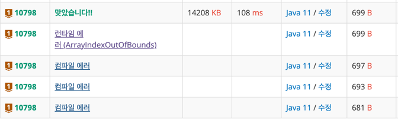

https://www.acmicpc.net/problem/10798

### 풀이 날짜
2025-06-06

### 문제 분석 요약
- 다섯줄로 입력받은 글자를 세로로 읽어주는 문제
- 각 줄에는 최소 1개, 최대 15개의 글자들이 빈칸 없이 연속으로
- 글자는 영어 대문자 ‘A’부터 ‘Z’, 영어 소문자 ‘a’부터 ‘z’, 숫자 ‘0’부터 ‘9’

### 알고리즘 설계
#### 필요한 값
- 한줄에 15글자, 5줄을 입력 받을 수 있는 이차원 배열 array

#### 풀이순서
1. 문자를 담을 이차원 배열 선언
2. 글자 5줄을 배열 안에 담아준다
    - 한줄씩 입력받아서 글자 단위로 잘라서 배열에 넣어준다 (charAt(i))
3. 2차원 배열을 출력한다(반복문)
    - 글자를 세로로 출력해주니까 열끼리 출력해야 한다
    - 중간에 빈 값은 제외하기 위해서 공백 `\0`이 없으면 출력해준다(조건문)
### 코드
```java
import java.util.*;
import java.io.*;

public class Main {
    public static void main(String[] args) throws IOException {
        BufferedReader br = new BufferedReader(new InputStreamReader(System.in));
        char[][] array = new char[5][15];
        
        for (int i = 0; i < 5; i++) {
            String line = br.readLine();
            for (int j = 0; j < line.length(); j++) {
                array[i][j] = line.charAt(j);
            }
        }
        
        for (int i = 0; i < 15; i++) {
            for (int j = 0; j < 5; j++){
                if (array[j][i] != '\0') {
                    System.out.print(array[j][i]);
                }
            }
        }
       
    }
}
```


### 시간 복잡도
- O(N^2)
    - 2차원 배열을 전체 탐색하기 때문
- 최대 연산 횟수 : 15 x 5

### 느낀점 or 기억할 정보
- 처음에 배열을 다섯개 선언하고 배열에 각각 넣어주는 방법을 생각했는데, 그렇게 하면 입력받는 부분도 다섯번 선언해야 해서 불필요한 느낌이 들었다. 그래서 찾아보니까 이차원 배열로 아예 배열을 한번만 선언하고 입력받을 수 있는 방법이 있다는걸 알게되었다.
- 공백을 건너띄는 방법이 `\0` 이 공백을 나타낸다. 그리고 다른풀이에서 StringBuilder을 사용하는 방법이 있어서 문자열을 붙여주는 방법을 사용할때 활용해봐야겠다.
```java 
StringBuilder sb = new StringBuilder();

for (int i = 0; i < max; i++) {
    for (int j = 0; j < 5; j++) {
        if(ch[j][i] == '\0') continue;
        sb.append(ch[j][i]);
        }
    }
    System.out.println(sb);
}

출처: [https://dev-coco.tistory.com/156](https://dev-coco.tistory.com/156) [슬기로운 개발생활:티스토리]
```