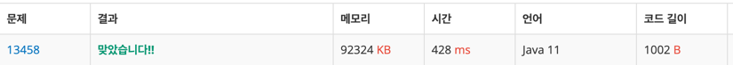

https://www.acmicpc.net/problem/13458

### 풀이 날짜
2025-06-05

### 문제 분석 요약
- 시험장에 응시자수 모두를 감독할 수 있는 감독 수를 구하는 문제
- 시험장 개수 N
- 시험장 응시자 수 A
- 총 감독관(한명만 가능) 한 시험장에서 감시할 수 있는 응시자 수 B명
- 부감독관(여러명 가능) 한 시험장에서 감시할 수 있는 응시자 수 C명

### 알고리즘 설계
#### 필요한 값
- 시험장 개수 담을 정수 N
- 총 감독관
- 감독관 수 count
#### 풀이순서
1. 시험장 개수 입력받기
2. 응시자수를 담을 배열 A 선언
3. 시험장 개수 만큼 반복한다
    - 응시자 수 A 를 입력받기
4. 감독관 별 감독 할 수 있는 학생 수 입력받기
5. (총감독관 감독수 - 시험장 별 응시자 수) > 0 인 경우 (남은 응시자가 있다)
   부감독관 개수를 올림
### 코드
```java
import java.io.*;
import java.util.*;

public class Main {
    public static void main(String[] args) throws IOException {
        // 시험장 개수 N
        BufferedReader br = new BufferedReader(new InputStreamReader(System.in));
        StringTokenizer st = new StringTokenizer(br.readLine());

        int N = Integer.parseInt(st.nextToken());

        // 응시자 수
        int[] A = new int[N];
        st = new StringTokenizer(br.readLine());
        for (int i = 0; i < N; i++) {
            A[i] = Integer.parseInt(st.nextToken());
        }

        // 감독관
        st = new StringTokenizer(br.readLine());
        int B = Integer.parseInt(st.nextToken());
        int C = Integer.parseInt(st.nextToken());

        long count = N;

        for (int i = 0; i < N; i++) {
            int leftStudent = A[i] - B;
            if (leftStudent > 0) {
                count += (long) Math.ceil((double)leftStudent / C);
            }
        }
        System.out.println(count);
    }
}

```



### 시간 복잡도
- O(N^2)
    - 2차원 배열을 전체 탐색하기 때문
- 최대 연산 횟수 : 81번

### 느낀점 or 기억할 정보
- Math.ceil을 할때 double로만 생각했는데 count 타입이 long이어서 변환이 추가로 필요하다.
``` java
Implicit cast from 'double' to 'long' in compound assignment can be lossy 
```

- 올림을 할때 형변환 하는 부분이 필요해서 다른 방법을 찾아보니까 올림공식이 있어서 이 부분도 활용할 수 있을것 같다.
```java
a = 10, b = 3
원래: 10 ÷ 3 = 3 (나머지 1) → 올림하면 4 
공식: (10 + 3 - 1) ÷ 3 = 12 ÷ 3 = 4
```
