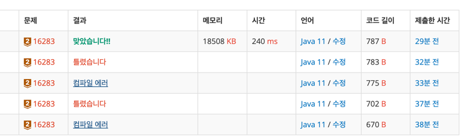

https://www.acmicpc.net/problem/16283

### 풀이 날짜
2025-05-22

### 문제 분석 요약
- 양 한마리는 하루에 사료를 a그램
- 염소 한 마리는 하루에 b그램
- 양과 염소가 전체 몇마리인지 확인하고, 양과 염소가 하루동안 소비한 전체 사료의 양만 확인해서 양과 염소가 각각 몇 마리 인지를 알려고 한다
- 양과 염소 전체가 n마리, 하루 동안 소비 한 전체 사료 양이 w 그램, 양과 염소가 각각 몇마리 ?
- 제약조건: 가능한 해가 두개 이상이거나 가능한 해가 없을 경우 -1 반환

### 알고리즘 설계

#### 필요한 값
- 양 한마리가 먹는 사료 : a
- 염소 한마리가 먹는 사료 : b
- 양과 염소 마리 수 : n
- 하루 동안 소비한 전체 사료 양: w
- 양이 x마리, 염소가 y마리라고 할때, x + y = n, ax + by = w
- 양 마리수 : sheep
- 염소 마리수 : goat

1. 표준입력으로 a, b, n, w를 입력받는다
2. 1부터 n - 1 까지 반복한다 (두 숫자를 합쳐서 n이 되어야 하기 때문)
    - i 랑 n - i 를 구한다
    - 조건문으로 ax + by = w가 되는지 확인한다
    - 맞는 값을 찾으면 count++
    - count가 2이상이거나 0이면 -1 반환
    - 1이면 i랑 n -1 반환

### 시간 복잡도
O(N)

- 1부터 N까지 -> O(N)
- `1 ≤ _a_ ≤ 1,000, 1 ≤ _b_ ≤ 1,000, 2 ≤ _n_ ≤ 1,000, 2 ≤ _w_ ≤ 1,000,000`
- ((a * x) + (b * y) == w)에서
    - a * x, b * y 의 최대값은 각각: 1,000 × 1,000 = 1,000,000
    - (a * x) + (b * y)의 최대값: 1,000,000 + 1,000,000 = 2,000,000

### 코드
```java
import java.util.Scanner;

public class Main {

  public static void main(String[] args) {

    int x = 0;
    int y = 0;
    int count = 0;

    // a, b, n, w 입력받기  
    Scanner sc = new Scanner(System.in);

    int a = sc.nextInt();
    int b = sc.nextInt();
    int n = sc.nextInt();
    int w = sc.nextInt();

    // n의 크기만큼 반복  
    for (int i = 1; i <= n; i++) {
      x = i;
      y = n - i;

      if ((a * x) + (b * y) == w) {
        count++;

      }
    }

    // count가 2이상이거나 0이면 -1 반환  
    if (count == 0 || count > 1) {
      System.out.println(-1);
    } else {
      System.out.print(x);
      System.out.print(y);
    }
  }
}
```

### 틀린 이유
- 처음에 문제 풀때 1 + (n -1) 이라는 걸 알았지만 반복문에서 n - 1로 설정하지 않았다.
- 양이랑 염소 마리수를 최상단에서 설정했지만, 내부에서 계산한 x, y 값을 sheep과 goat 새로운 변수에 할당하지 않았다.

### 정답 코드
```java
import java.util.Scanner;

public class Main {

  public static void main(String[] args) {

    int sheep = 0;
    int goat = 0;
    int count = 0;

    // a, b, n, w 입력받기
    Scanner sc = new Scanner(System.in);

    int a = sc.nextInt();
    int b = sc.nextInt();
    int n = sc.nextInt();
    int w = sc.nextInt();

    // n의 크기만큼 반복
    for (int i = 1; i <= n - 1; i++) {
      int x = i;
      int y = n - i;

      if ((a * x) + (b * y) == w) {
        count++;
        sheep = x;
        goat = y;
      }
    }

    // count가 1이면 양과 염소 반환, 그외 -1 반환
    if (count == 1) {
      System.out.println(sheep + " " + goat);
    } else {
      System.out.println(-1);
    }
  }
}
```



### 느낀점 or 기억할 정보
- 어떻게 구할지나 시간복잡도를 미리 생각해보고 구현을 해야 틀렸을때 고치는 시간을 단축할 수 있다.
