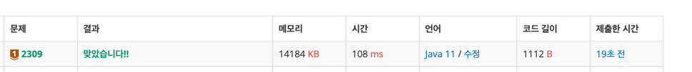

https://www.acmicpc.net/problem/2309

### 풀이 날짜
2025-05-23

### 문제 분석 요약
- 일곱난쟁이 키 합이 100
- 아홉난쟁이 키가 주어졌을 때 일곱난쟁이 찾는 프로그램
- 일곱 난쟁이의 키를 오름차순으로 출력한다. 일곱 난쟁이를 찾을 수 없는 경우는 없다
- 가능한 정답이 여러 가지인 경우에는 아무거나 출력

### 알고리즘 설계

#### 처음 접근
1. 9개의 숫자를 입력받는다
    - 9개라고 명시했으니까 크기가 9인 배열 선언
2. 9개 숫자 중 7개를 뽑아 합이 100인지 확인
3. 100이 되면 7개 숫자를 출력해준다

#### 수정한 접근
1. 크기 9인 정수 배열 선언
    - 전체 합을 저장할 변수 선언
2. 9개 숫자를 하나씩 입력받기
    -  입력받으면서 동시에 전체 합 계산
3. 배열을 오름차순으로 정렬 (출력 형식에 맞추기 위함)
4. 제외할 2개 찾기 (핵심 로직)
    - 이중반복문 사용해 `전체합 - arr[i] - arr[j]`  계산 결과가 100인지 확인
5. 100이 되는 조합을 찾았다면
    - 세 번째 반복문: k = 0부터 8까지 k가 i도 j도 아닌 경우만 arr[k] 출력
    -  출력 후 프로그램 종료
#### 필요한 값
- 9개 숫자를 담을 배열 arr
- 9개 숫자 전체 합 변수 total

### 코드
```java
import java.io.*;
import java.util.*;

public class Main {
    public static void main(String[] args) throws IOException {
        BufferedReader br = new BufferedReader(new InputStreamReader(System.in));
	    // 크기가 9인 배열 선언
        int[] arr = new int[9];
        int total = 0;

		// 숫자 9개 입력 받고 배열에 저장
		// total에 넣어준다
        for (int i = 0; i < 9; i++) {
            arr[i] = Integer.parseInt(br.readLine());
            total += arr[i];
        }

		// 오름차순으로 출력하기 위해 배열 정렬
        Arrays.sort(arr); 
        
        for (int i = 0; i < 9; i++) {
            for (int j = i + 1; j < 9; j++) {
                int now = total - arr[i] - arr[j];
                if (now == 100) { // 2개 수를 빼서 100이 되면 배열 출력
                    for (int k = 0; k < 9; k++) {
	                    if (k != i && k != j) {
		                    System.out.println(arr[k]);
	                    }
                    }
                    return; // 정답 찾으면 종료
                }
            }
        }
    }
}
```



### 시간 복잡도
O(n^2): 2중 반복문으로 모든 2개 조합 확인

### 틀린 이유
- 처음에 접근했던 방식이  9개 숫자 중 7개를 뽑아 합이 100인지 확인 하는거였는데,  부분에서 막혔다
- 이전에 풀어본 적이 있었는데도 다시 풀어도 다시 몰라서 반복만이 살길..!

### 느낀점 or 기억할 정보
- 공식을 알지못해도 대부분의 문제는 풀 수 있으니까 동작하는 경우를 잘 확인하는게 중요하다 