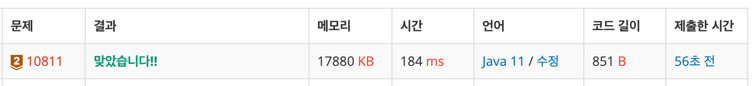

https://www.acmicpc.net/problem/10811

### 문제 풀이 날짜
2025-12-01

### 문제 분석 요약
-  N개의 바구니에서 M번 바구니의 순서를 역순으로 만들어서 최종 바구니의 번호를 출력하는 문제

### 문제의 핵심
- 
### 제약조건
- N (1 ≤ N ≤ 100)과 M (1 ≤ M ≤ 100)
- i   -> j 바구니 순서를 역순으로 만든다(1 ≤ i ≤ j ≤ N)
### 알고리즘 설계

#### 입력
- `N`: 1부터 N개의 바구니
    - N만큼의 크기의 배열을 선언한다
- `M`: 역순으로 바구니의 순서를 변경해야 하는 횟수
#### 연산
- M의 크기만큼 반복한다
    - start가 end와 동일해질때까지
    - swap 로직을 실행한다
#### 출력
- 역순으로 위치를 변경한 바구니의 순서를 공백으로 구분해 출력
    - StringBuilder 사용해 배열의 값과 공백을 함께 붙여서 출력한다(이문제에서는 값이 작아서 배열 출력으로도 가능하다)
### 시간 복잡도
- O(N^M)
    - 1 ≤ N ≤ 100, 1 ≤ M ≤ 100 이고 swap 로직에서 최악의 경우 O(N) 번 뒤집을 수 있다
### 코드
```java  
import java.util.Scanner;

public class Main {
    public static void main(String[] args) {
        Scanner sc = new Scanner(System.in);

        // 입력
        int N = sc.nextInt();
        int[] array = new int[N + 1];
        for (int i = 1; i <= N; i++) {
            array[i] = i;
        }

        int M = sc.nextInt();
        for (int i = 0; i < M; i++) {
            int start = sc.nextInt();
            int end = sc.nextInt();

            while (start <= end) {
                int temp = array[start];
                array[start] = array[end];
                array[end] = temp;

                start++;
                end--;
            }
        }
        StringBuilder sb = new StringBuilder();
        for (int i = 1; i <= N; i++) {
            sb.append(array[i]).append(" ");
        }
        System.out.println(sb);
    }
}
```


### 알게된점
- swap을 해야할 때 어떤 기준으로 어디에서 반복을 해야하는지를 잘 이해해야한다.