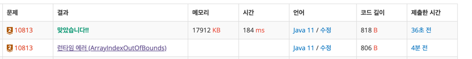

https://www.acmicpc.net/problem/10813

2025-11-21

### 문제 분석 요약
- N개의 바구니안에 있는 숫자를 M번 교환한 배열을 반환하는 문제

### 문제의 핵심
- N개의 바구니를 입력 받아서 M번 공을 바꾼다
- 2차원배열이나 ArrayList에 넣어줘야 한다고 생각했지만 배열을 저장할 필요가 없고, 입력을 받는 동시에 바로 위치를 바꿔주면 된다 -> 배열만으로 충분
- -> swap 한다 !

### 제약조건
- N (1 ≤ N ≤ 100)과 M (1 ≤ M ≤ 100)
### 알고리즘 설계

#### 입력
- 첫째줄에서 정수 N, M을 입력받는다 (크기가 100이하니까 Scanner로도 풀 수 있다)
- M 만큼 두개의 숫자를 입력받는다 num1, num2
#### 연산
- M의 크기만큼 반복문을 수행한다
    - 두개의 숫자를 입력받는다
    - temp를 선언한다
    - 배열 첫번째 인덱스 값을 temp에 넣는다
    - 두번째 값을 첫번째에 넣는다
    - temp를 두번째에 넣는다

#### 출력
- StringBuilder을 사용해서 array 배열에 값을 붙여서 출력해준다
### 시간 복잡도
- O(N + M):
    - N과 M 반복문이 각각 O(N) 과 O(M)
    - 내부에서 swap은 O(1) -> 배열의 인덱스를 직접 접근하기 때문
    - 최대 M번의 반복이 일어난다

### 코드
```java  
import java.util.*;
public class Main {
    public static void main(String[] args) {
        // 입력
        Scanner sc = new Scanner(System.in);
        int N = sc.nextInt();
        int M = sc.nextInt();

        int[] array = new int[N];
        for (int i = 0; i < N ; i++) {
            array[i] = i + 1;
        }

        // 연산
        for (int i = 0; i < M ; i++) {
            int firstNum = sc.nextInt();
            int secondNum = sc.nextInt();

            int temp;
            temp = array[firstNum -1];
            array[firstNum -1] = array[secondNum -1];
            array[secondNum -1] = temp;
        }

        // 출력
        StringBuilder sb = new StringBuilder();
        for (int num : array) {
            sb.append(num).append(" ");
        }
        System.out.println(sb);
    }
}
```


### 알게된점
- `ArrayIndexOutOfBounds` 에러가 나서 보니까 N과 M을 접근할때 다르게 접근하고 있었다 
