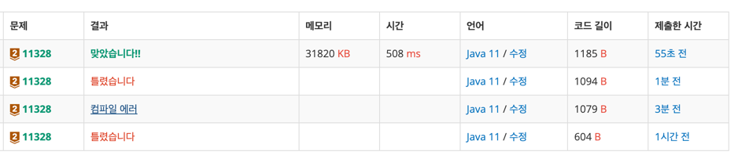

https://www.acmicpc.net/problem/11328

### 문제 풀이 날짜
2025-10-01

### 문제 분석 요약
- **strfry** 함수는 입력된 문자열을 무작위로 재배열하여 새로운 문자열을 만들어낸다
- 두 개의 문자열에 대해, 2번째 문자열이 1번째 문자열에 **strfry** 함수를 적용하여 얻어질 수 있는지 판단해서 "Impossible"(불가능) 또는 "Possible"(가능)으로 출력하는 문제

### 제약조건
-  테스트 케이스의 수 0 < **N** < 1001
- 각각의 문자열의 길이는 최대 1000
### 알고리즘 설계

#### 변수
- 두개의 단어의 인덱스를 확인하는 정수형 배열 countA, countB
-
#### 입력
- 전체 테스트 개수 N
- N의 개수만큼 String 단어 두개를 입력받는다
    - 한번에 입력받고 공백 기준으로 split해서 단어 배열에 담는다
    - 각각 사용하기 위해  `wordA =  word[0]`, `wordB = word[1]` 로 선언한다

#### 연산
- 각 단어의 문자를 순회한다
    - 인덱스 값을 구해주기 위해 문자 - 'a'를 사용
    - 알파벳 세어주는 배열의 인덱스를 ++
#### 출력
- 두개 배열을 비교해서 일치하면 Possible, 일치하지 않으면 Impossible

### 시간 복잡도
- O(N)
    -  테스트케이스의 개수만큼 반복한다
### 코드
```java  

import java.util.Arrays;
import java.util.Scanner;

public class Main {
    public static void main(String[] args) {
        // 입력
        Scanner sc = new Scanner(System.in);
        int N = sc.nextInt();
        sc.nextLine();

        for (int i = 0; i < N; i++) {
            String[] words  = sc.nextLine().split(" "); // 한번에 입력 받아서 단어 두개를 배열 하나에 넣어줌
            String wordA = words[0];
            String wordB = words[1];

            // 연산
            // 알파벳 배열에 넣어서 인덱스를 더해줌
            int[] countA = new int[26];
            for (char c : wordA.toCharArray()) {
                int index = c - 'a';
                countA[index]++;
            }
            
            int[] countB = new int[26];
            for (char c : wordB.toCharArray()){
                int index = c - 'a';
                countB[index]++;
            }

            // 두개배열 비교
            // 출력
            if (Arrays.equals(countA, countB)) {
                System.out.println("Possible");
            } else {
                System.out.println("Impossible");
            }
        }
    }
}


```



### 알게된점
- indexOf를 사용하려고 했는데 indexOf는 같은 단어가 두개 이상 있는 경우에는 사용이 불가능하다 ( 있는지만 확인할 수 있다)
```java
            // 연산  
            for(char c : wordB.toCharArray()) {  
                if (wordA.indexOf(c) == -1) {  
                    System.out.println("Impossible");  
                    return;  
                }  
                System.out.println("Possible");  
            }  
        }  
    }  
}
```

- 문자열이 일치하는지 확인하는 방법
    1. HashMap에 담아서 Map이 일치하는지 확인
       ```java
       HashMap<Character, Integer> countA = new HashMap<>();
        for (char c : wordA.toCharArray()) { 
            countA.put(c, countA.getOrDefault(c, 0) + 1);
         }
       ```
    2. 알파벳의 크기만큼의 배열을 선언하고 해당 인덱스의 크기로 일치하는 개수를 확인
  ```java
  int[] countA = new int[26];
   for (char c : wordA.toCharArray()) { 
   int index = c - 'a';
    countA[index]++;
     }
  ```