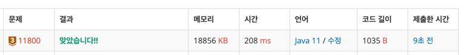

https://www.acmicpc.net/problem/11800

### 문제 풀이 날짜
2025-09-30

### 문제 분석 요약
- 주사위의 각면에 별칭이 있고 주사위를 던질때 나오는 큰 수부터 별칭을 출력하는 문제

### 제약조건
- 주사위 수가 6-5 ( 5-6 ) 이 나오는 경우에는 "Sheesh Bang" 은 어감이 좋지 않아서 "Sheesh Bang" 대신에 "Sheesh Beesh" 로 출력
### 알고리즘 설계

#### 변수
- 주사위 별칭 문자열 배열
- 주사위 값이 같은 경우 문자열 배열
#### 입력
- 전체 테스트 개수 T
- T의 개수만큼 두개의 숫자를 한 줄에 입력받는다

#### 연산
- 두 숫자가 같은 경우 같은 숫자를 읽는 배열의 인덱스를 읽어온다
- 주사위 수가 6-5 ( 5-6 ) 이 나오는 경우에는 "Sheesh Beesh" 를 출력하도록 한다
- 두 숫자가 다른 경우 번호에 해당하는 인덱스를 읽어온다
- 그 외에 경우에는 index 배열에서 각각의 숫자를 읽어와서 두개 중 큰 숫자로 출력을 한다
    - Math.max로 비교

#### 출력
- Case n: 형식으로 출력한다

### 시간 복잡도
- O(N)
    -  테스트케이스의 개수만큼 반복한다
### 코드
```java  
import java.util.Scanner;

public class Main {
    public static void main(String[] args) {
        String[] index = new String[]{"Yakk", "Doh","Seh", "Ghar", "Bang" ,"Sheesh"};
        String[] evenNum = new String[]{"Habb Yakk", "Dobara", "Dousa", "Dorgy", "Dabash", "Dosh"};

        // 입력
        Scanner sc = new Scanner(System.in);
        int T = sc.nextInt();

        // 연산
        for (int i = 1; i <= T ; i++) {
            int diceA = sc.nextInt();
            int diceB = sc.nextInt();

            String result;

            if(diceA == diceB) {
                result = evenNum[diceA - 1];
            } else if ((diceA == 6 && diceB == 5) || (diceA == 5 && diceB == 6)) {
                result = "Sheesh Beesh";
            } else {
                int max = Math.max(diceA, diceB);
                int min = Math.min(diceA, diceB);
                result = index[max-1] + " " + index[min-1];
            }
            // 출력
            System.out.println("Case " + i + ": " + result);
        }
    }
}

```



