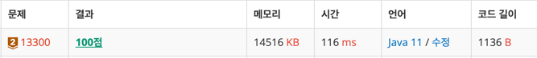

https://www.acmicpc.net/problem/13300

### 풀이 날짜
2025-06-04

### 문제 분석 요약
- 같은 학년, 같은 성별 별로 학생을 배정할 때 필요한 방의 최소 개수 구하는 문제
### 알고리즘 설계
#### 필요한 값
- 한 방에 배정할 수 있는 최대 인원 정수 K
- 수학여행에 참가하는 학생 수 정수 N
- 학생의 성별 S
- 학생 학년 Y
- 방의 개수 세어줄 변수 total
#### 풀이순서
1. 수학여행 참가 학생수, 한방에 배정할 인원수 입력 받기
2. 참가하는 학생수 만큼 반복문으로 입력받기
    1. 학생 성별, 학년을 이차원 배열에 담아주기
3. 이차원 배열을 돌면서 필요한 방의 개수 계산하기
    1. 필요한 방의 개수 = 학생 수 / K (올림 계산)

### 코드
```java
import java.io.*;
import java.util.StringTokenizer;

public class Main{
    public static void main(String[] args) throws IOException {
        // 수학여행 참가 학생수, 한방에 배정할 인원수 입력 받기  
    BufferedReader br = new BufferedReader(new InputStreamReader(System.in));  
    StringTokenizer st = new StringTokenizer(br.readLine());  
    int N = Integer.parseInt(st.nextToken());  
    int K = Integer.parseInt(st.nextToken());  
  
    // 학생 배열  
    int[][] students = new int[2][6];  
  
    // 참가하는 학생수 만큼 반복문으로 입력받기  
    for (int i = 0; i < N; i++) {  
        st = new StringTokenizer(br.readLine());  
        int gender = Integer.parseInt(st.nextToken());  
        int grade = Integer.parseInt(st.nextToken());  
  
        // 성별과 학년 별 학생 수 담는 배열   
students[gender][grade - 1]++;  
    }  
    int total = 0;  
  
    for (int gender = 0; gender < 2; gender++) {  
        for (int grade = 0; grade < 6; grade++) {  
            int studentCount = students[gender][grade];  
  
            if (studentCount > 0) {
                int rooms = (int) Math.ceil((double) studentCount / K); 
                total += rooms;  
            }  
        }  
    }  
    System.out.println(total);  

    }
}
```



### 시간 복잡도
- O(N)
    - N명만큼 비례해서 학생 정보를 받아와서 O(N)

### 느낀점 or 기억할 정보
- 학생수를 어떻게 세어줄 지 생각이 안났는데 배열 자체가 학생 수를 세어주는 것을 의미한다는 것을 알게되었다.
- 시간복잡도를 계산하는게 아직도 좀 어렵다. 반복문의 개수에 비례하는게 아니고 반복 횟수가 입력 크기와 무관한 상수면 O(1)이다