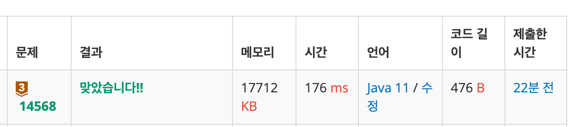

https://www.acmicpc.net/problem/14568

### 문제 풀이 날짜
2025-07-23

### 문제 분석 요약
- 택희, 영훈, 남규는 사탕 N개를 받았고 세명에게 사탕을 나눠주는 방법의 수
    -  남는 사탕은 없어야 한다.
    - 남규는 영훈이보다 2개 이상 많은 사탕을 가져야 한다.
    - 셋 중 사탕을 0개 받는 사람은 없어야 한다. -> 모든 수가 1보다 같거나 커야함
    - 택희가 받는 사탕의 수는 홀수개가 되어서는 안 된다. -> 짝수만

제약조건
- 사탕의 개수 (1 ≤ N ≤ 100)
-  규칙에 맞게 사탕을 분배하는 방법이 없다면 0을 출력한다.
### 알고리즘 설계

#### 입력
- 사탕의 개수 N을 입력받는다
#### 연산
- 조건을 만족하는 방법을 담을 변수 count 초기화
- 택희(A):  1보다 큰 짝수 2부터 확인 `A = 2`
- 영훈(B): 1보다 크기만 하면 됨 `B >= 1`
- 남규(C): 영훈보다 2개 이상 많은 사탕 `C >= B + 2`
- C의 조건을 만족하는 경우 count ++

#### 출력
- count 변수 출력

### 시간 복잡도
- O(N^2)
- N/2 로 시작하지만 N의 개수에 비례해서 루프가 돌기 때문에 N^2
### 코드
```java  
import java.util.*;

public class Main{
    public static void main(String[] args) {
        Scanner sc = new Scanner(System.in);
        int N = sc.nextInt();
        
        int count = 0;
        
        for(int A = 2; A < N; A += 2){
            for (int B = 1; B < N - A; B++){
                int C = N - A - B;
                if (C >= B + 2) {
                    count++;
                }
            }
        }
        
        System.out.println(count);
    }
}
```




### 느낀점 or 기억할 정보
- 3가지 중에 어떤 수를 각각 A,B,C로 설정할지에 대한 고민이 있어서 찾아봤다
    1. 제약이 가장 강한 변수부터 고정하기
    2. 반복문 범위가 명확한 변수 우선하기
    3. 다른 변수들과의 관계가 단순한 변수 선택하기