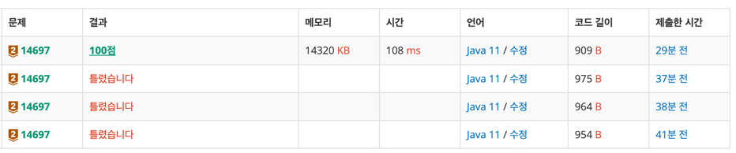

https://www.acmicpc.net/problem/14697

### 풀이날짜
2025-09-09

### 문제 분석 요약
- 배정된 모든 방에 빈 침대가 없도록 방 배정이 가능한지를 결정하는 프로그램

제약조건
- 방의 정원을 나타내는 서로 다른 세 자연수 A, B, C (1 ≤ A < B < C ≤ 50)와 전체 학생 수를 나타내는 자연수 N (1 ≤ N ≤ 300)이 공백으로 분리되어 한 줄에 주어진다.
- 빈 침대 없이 배정이 가능할 경우 표준 출력으로 1을, 불가능할 경우 0을 출력
- 세 종류의 방을 모두 활용하지 않고 한 종류, 두 종류 방만 이용하는 것도 허용
### 알고리즘 설계

#### 입력
- 4개의 정수 배열에 저장

#### 핵심 아이디어
`A * x + B * y + C * z` 를 만족하는 해를 구하는 문제

#### 변수
- 입력받은 A,B,C와 N
- afterA = a방 계산하고 남은 학생
- afterB = b방 계산하고 남은 학생

#### 연산
- A방 개수를 하나씩 증가 시키면서 N/A의 최대값 까지 반복문으로 확인
    - a방 남은 학생 =  `N - A * a방의 개수 `
    - B방 개수를  a방 남은 학생 /B 으로 나누는 최대값까지 반복문으로 확인
    - 남은 학생을 C방으로 나눴을때 나누어떨어지면 (남은 학생이 없으면)
    - 1출력
- 그렇지 않으면 0 출력
### 시간 복잡도
- O(N^2)
  - 최대 가능한 연산 = (N/A) × (N/B) = 300 × 150 = 45,000번 
### 코드
```java  
import java.io.*;
import java.util.*;

public class Main {
    public static void main(String[] args) throws IOException {
        BufferedReader br = new BufferedReader(new InputStreamReader(System.in));
        StringTokenizer st = new StringTokenizer(br.readLine());

        // 입력
        int A = Integer.parseInt(st.nextToken());
        int B = Integer.parseInt(st.nextToken());
        int C = Integer.parseInt(st.nextToken());
        int N = Integer.parseInt(st.nextToken());

        // 연산
        for (int roomA = 0; roomA <= N / A ; roomA++) {
            int afterA = N - A * roomA;

            for (int roomB = 0; roomB <= afterA / B; roomB++) {
                int afterB = afterA - B * roomB;

                if(afterB % C == 0) {
                    System.out.println(1);
                    return;
                }
            }
        }

        System.out.println(0);
    }
}
```


### 느낀점 or 기억할 정보
- 처음 풀때 남은 학생 수를 변수 하나만으로 관리해서 a에서 계산하고 남은 학생 수를 b에서 다시 계산한다고 생각했는데 같은 변수로 덮어쓰게 되면 a에서 계산하고 남은 수가 아닌 b에서 계산한 수가 저장되어서 값이 달라진다
```java
for (int roomA = 1; roomA <= N / A ; roomA++) {
	leftStudent = N - A * roomA;

	for (int roomB = 0; roomB < leftStudent / B; roomB++) {
		leftStudent = leftStudent - B * roomB;

		if(leftStudent % C == 0) {
			System.out.println(1);
			break;
		}
	}
}

```