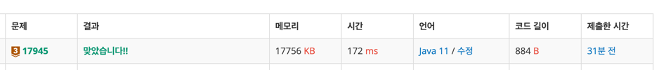

https://www.acmicpc.net/problem/17945

### 문제 풀이 날짜
2025-07-21

### 문제 분석 요약
- x2  + 2Ax + B = 0 의 두 계수 A, B가 주어진다.
- 첫 번째 줄에 방정식의 근들을 모두 공백으로 분리해 오름차순으로 출력한다. 중근일 경우 하나만 출력

제약조건
-  A, B는 정수이며, 이 방정식의 근은 항상 정수이다. (-1000 ≤ A, B ≤ 1000)
### 알고리즘 설계

#### 입력
- 정수 A, B를 입력받는다
#### 연산
- -1000 부터 1000까지 반복한다
- A, B를 `x2  + 2Ax + B = 0` 식에 넣는다
- x2  + 2Ax + B = 0를 만족하는 수를 찾는다

#### 출력
- roots 리스트의 원소를 뽑아와서 출력해준다
- 마지막 원소가 아닌 경우를 제외하고 공백을 붙여준다

### 시간 복잡도
- O(N)
- 이 문제에서 가장 시간복잡도가 큰 건 정렬이지만 이 문제에서 최대 2개의 값을 정렬하기 때문에 정렬 연산의 횟수가 2회로 고정된다
- 그래서 O(2001)로 O(N)이 된다.

### 코드
```java  
import java.util.*;

public class Main {
    public static void main(String[] args) {
        // 계수 A, B를 입력받는다
        Scanner sc = new Scanner(System.in);
        int A = sc.nextInt();
        int B = sc.nextInt();
        
        // 구한 근을 넣어줄 리스트 선언
        List<Integer> roots = new ArrayList<>();
        
        // 연산
        for(int x = -1000 ; x < 1000; x++) {
            if (x*x + 2*A*x + B == 0) {
                if (!roots.contains(x)) {
                    roots.add(x);
                }
            }
        }
        
        // 오름차순 정렬
        Collections.sort(roots);

        // 출력
        for(int i = 0 ; i < roots.size(); i++) {
            System.out.print(roots.get(i));
            if (i < roots.size() - 1) {
                System.out.print(" ");
            }
        }
        System.out.println();
        
    }
}
```



### 느낀점 or 기억할 정보
- 이 문제는 이차방정식 근의 공식을 사용하는 문제였다
- 수학관련된 문제가 나올 때마다 수학 공식을 알아야 풀 수 있다는 생각이 들어서 소극적으로 문제를 풀게 되는데, 프로그래밍으로 어떻게 해결할지에 대해서 더 많은 고민이 필요하다! 