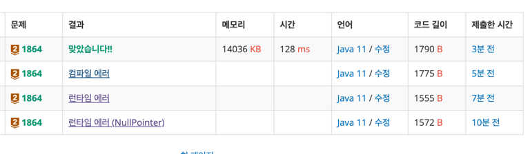

https://www.acmicpc.net/problem/1864

### 풀이 날짜
2025-05-28

### 문제 분석 요약
- 문어 숫자(8진법)에 대응하는 십진수를 출력하는 문제
    - -는 0에 대응한다.
    - \는 1에 대응한다.
    - (는 2에 대응한다.
    - @는 3에 대응한다.
    - ?는 4에 대응한다.
    - >는 5에 대응한다.
    - &는 6에 대응한다.
    - %는 7에 대응한다.
    - /는 -1에 대응한다.
-
### 알고리즘 설계
#### 필요한 값
- 문어숫자 입력받을 변수 octopusString
- 문어숫자 길이 세어줄 변수 length
- 자리수 계산한 변수 : number
- 10진법으로 변환한 결과 변수 result
#### 풀이순서
1. 문어 숫자를 입력 받는다
    - 공백 기준(readLine) 으로 문자열을 입력을 받는다
    - while문으로 반복해 `#` 이 있으면 반복문을 종료한다
2. 문자열을 분리해준다
    - 문자열의 길이만큼 반복한다
    - 문자열을 문자 단위로 분리한다(charAt)
3.  문자에 대응하는 숫자를 찾아준다(switch)
4. 자리수를 계산하고 10진법 단위로 숫자를 세어준다
    - 자리수 계산하는 법: `문자열길이 - 1 - 현재인덱스`
    - 10진법으로 계산하는 법 : `대응하는 숫자 x (8 ^ 자리수)`
5. 계산한 숫자를 result 변수로 출력해준다

### 코드
```java
import java.io.*;

public class Main{
    public static void main(String[] args) throws IOException {
        
        BufferedReader br = new BufferedReader(new InputStreamReader(System.in));
        
        while(true) {
            String octopusString = br.readLine();
            if (octopusString.equals("#")) break;
            
            int result = 0; //누적 숫자 합
            
            int length = octopusString.length();
            for (int i = 0; i < length; i++) {
                char eachChar = octopusString.charAt(i);
                int number = 0; // 문자에서 숫자 변환한값 
                
                switch(eachChar){
                    case '-':
                        number = 0;
                        break;
                    case '\\':
                        number = 1;
                        break;
                    case '(':
                        number = 2;
                        break;
                    case '@':
                        number = 3;
                        break;
                    case '?':
                        number = 4;
                        break;
                    case '>':
                        number = 5;
                        break;
                    case '&':
                        number = 6;
                        break;
                    case '%':
                        number = 7;
                        break;
                    case '/':
                        number = -1;
                        break;
                }
                
                int digit = 0;
                digit = length - 1 - i;
                result += (int) number * Math.pow(8, digit);
            }
            System.out.println(result);
        }      
    }
}
```

### 풀이 결과


### 시간 복잡도
- 입력받은 문자열의 길이를 하나씩 확인하기 때문에 입력받은 총 문자의 개수만큼의 크기의 O(N)

### 느낀점 or 기억할 정보
- 기본적인 문법을 작성할때 조금씩 실수가 있어서 여러번 시도하게 되는데 제출하기 전 한번 더 확인 ! 
- 풀이 과정을 작성할때 실제로 구현 단계에서 바로 적용할 수 있도록 더 자세히 작성해봐야 한다. 오늘 문제의 경우 자리 수 외에 문자열에서 문자로 분리해서 대응하는 수 찾는 부분이 빠져서 구현할 때 어디에 추가해줘야하는지 헷갈렸다

- AS-IS :
```
문자열의 원소 위치에 따라서 문자에 대응하는 숫자 x 8진법 자리수를 계산해준다
```

- TO-BE:
```
2. 문자열을 분리해준다
	- 문자열의 길이만큼 반복한다
	- 문자열을 문자 단위로 분리한다(charAt)
3.  문자에 대응하는 숫자를 찾아준다(switch)
4. 자리수를 계산하고 10진법 단위로 숫자를 세어준다
	- 자리수 계산하는 법: `문자열길이 - 1 - 현재인덱스`
	- 10진법으로 계산하는 법 : `대응하는 숫자 x (8 ^ 자리수)`
``````

- 문자열 -> char 처리 방식
```java
// 1. charAt() 사용
char c = octopusString.charAt(i); 
// 2. 문자열을 char 배열로 변환 
char[] chars = octopusString.toCharArray(); char c = chars[i]; 
// 3. 향상된 for문 (인덱스 필요 없을 때) 
for (char c : octopusString.toCharArray()) {}
```