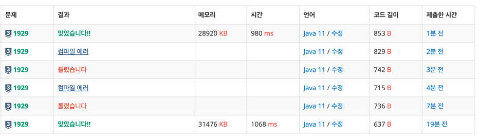

https://www.acmicpc.net/problem/1929

### 문제 풀이 날짜
2025-08-20

### 문제 분석 요약
- M이상 N이하의 소수를 모두 출력하는 프로그램

제약조건
- 첫째 줄에 자연수 M과 N이 빈 칸을 사이에 두고 주어진다. (1 ≤ M ≤ N ≤ 1,000,000) M이상 N이하의 소수가 하나 이상 있는 입력만 주어진다.
### 알고리즘 설계

#### 입력
- 정수 M, N 입력 받는다
    - 범위는 100만이지만 숫자 2개만 입력받아서 scanner로 입력 받는 것으로 충분하다고 생각
#### 연산
-  소수는 1과 자기 자신으로만 나눠지는 수
    - 2부터 자기자신 -1 까지 수로는 나눠지지 않는다

- 범위 : M부터 N까지 범위의 수를 확인
- 소수인지를 판별할 flag 변수 isPrime 선언
- 숫자를 2부터 자기자신 -1 까지의 수로 확인
    - 나눠지는 경우 반복문 탈출
- 나눠지지 않는 경우 소수 출력
#### 출력
- 확인하는 숫자가소수인 경우 출력

### 시간 복잡도
- O(N)
### 코드
```java  
import java.util.Scanner;

public class Main {
    public static void main(String[] args) {
        // 입력
        Scanner sc = new Scanner(System.in);
        int M = sc.nextInt();
        int N = sc.nextInt();

        // 연산
        // 소수(2와 자기자신 -1 사이에 나눠지는 수가 있으면 소수가 아니다라는 조건 이용)
        
        for (int number = M; number <= N; number++) {
            boolean isPrime = true;
            
            if (number < 2) {
                isPrime = false;
            }
            
            for (int i = 2; i <= Math.sqrt(number); i++) {
                if (number % i == 0) {
                    isPrime = false;
                    break;
                }
            }

            if (isPrime) {
                System.out.println(number);
            }
        }
    }
}
```



### 느낀점 or 기억할 정보
- 소수 구하는 부분을 따로 함수로 분리해서 확인하는 경우도 풀어봤다
    - 소수를 활용하는 문제에 적합
```java
import java.util.Scanner;  
  
public class B1929 {  
    public static void main(String[] args) {  
        // 입력  
        Scanner sc = new Scanner(System.in);  
        int M = sc.nextInt();  
        int N = sc.nextInt();  
  
        // 연산  
        for (int number = M; number <= N ; number++) {  
            if (isPrime(number)) {  
                System.out.println(number);  
            }  
        }  
    }  
  
    public static boolean isPrime(int n) {  
        if (n < 2) return false;  
        for (int i = 2; i <= Math.sqrt(n); i++) {  
            if (n % i == 0) {  
                return false;  
            }  
        }  
        return true;  
    }  
}

```