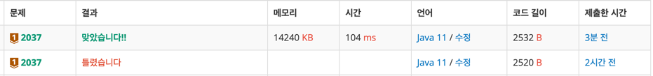

https://www.acmicpc.net/problem/2037

### 풀이 날짜
2025-05-23

### 문제 분석 요약
- 영어 메세지를 치려고 할때 걸리는 최소시간을 구하는 문제
-
### 알고리즘 설계
#### 필요한 값
- 버튼을 한번 누르는데 걸리는 시간 변수 p
- 같은 숫자인 문자를 연속으로 찍기 위해 기다리는 시간 w
- 입력 받은 메세지 String 변수: message
- 전체 걸리는 시간 totalTime
- 문자가 몇번째 키인지 저장할 배열 : keyNum
- 문자를 입력하려면 눌러야 하는 횟수저장하는 배열 : pressCount
- 현재 문자의 키 번호: currentKey
- 이전 키 번호 저장할 int 변수 prevKey
- 현재 문자를 입력하기 위해 눌러야 하는 횟수press
#### 풀이순서
1. 각 문자(A~Z, 공백)의 키 번호와 누르는 횟수 저장
2. 입력 메세지를 한글자씩 처리하는 문자열 순회
3. 시간 계산
    - 현재 문자의 키 번호와 이전 문자의 키 번호 비교
    - 같으면 대기시간 w 추가
    - 버튼 누르는 시간(p x 누르는 횟수 추가)
4. 이전 키 업데이트 -> 다음 문자 처리를 위해 현재 키를 이전 키로 저장
5. 총 시간 출력

### 코드
```java
import java.io.*;
import java.util.*;

public class Main{
    public static void main(String[] args) throws IOException {
        BufferedReader br = new BufferedReader(new InputStreamReader(System.in));
        StringTokenizer st = new StringTokenizer(br.readLine());
        
        int p = Integer.parseInt(st.nextToken());
        int w = Integer.parseInt(st.nextToken());
        
        String message = br.readLine();
        
        int[] keyNum = new int[27];
        int[] pressCount = new int[27];
        
        // 숫자 담기
        keyNum[0] = 2; pressCount[0] = 1;  // A
        keyNum[1] = 2; pressCount[1] = 2;  // B
        keyNum[2] = 2; pressCount[2] = 3;  // C
        
        keyNum[3] = 3; pressCount[3] = 1;  // D
        keyNum[4] = 3; pressCount[4] = 2;  // E
        keyNum[5] = 3; pressCount[5] = 3;  // F
        
        keyNum[6] = 4; pressCount[6] = 1;  // G
        keyNum[7] = 4; pressCount[7] = 2;  // H
        keyNum[8] = 4; pressCount[8] = 3;  // I
        
        keyNum[9] = 5;  pressCount[9] = 1;   // J
        keyNum[10] = 5; pressCount[10] = 2;  // K
        keyNum[11] = 5; pressCount[11] = 3;  // L
        
        keyNum[12] = 6; pressCount[12] = 1;  // M
        keyNum[13] = 6; pressCount[13] = 2;  // N
        keyNum[14] = 6; pressCount[14] = 3;  // O
        
        keyNum[15] = 7; pressCount[15] = 1;  // P
        keyNum[16] = 7; pressCount[16] = 2;  // Q
        keyNum[17] = 7; pressCount[17] = 3;  // R
        keyNum[18] = 7; pressCount[18] = 4;  // S
        
        keyNum[19] = 8; pressCount[19] = 1;  // T
        keyNum[20] = 8; pressCount[20] = 2;  // U
        keyNum[21] = 8; pressCount[21] = 3;  // V
        
        keyNum[22] = 9; pressCount[22] = 1;  // W
        keyNum[23] = 9; pressCount[23] = 2;  // X
        keyNum[24] = 9; pressCount[24] = 3;  // Y
        keyNum[25] = 9; pressCount[25] = 4;  // Z
        
        keyNum[26] = 1; pressCount[26] = 1;
        
        int totalTime = 0;
        int prevKey = -1;
        
        for (int i = 0; i < message.length(); i++) {
            char c = message.charAt(i);
            
            int index = (c == ' ') ? 26 : c - 'A';
            
            int currentKey = keyNum[index];
            int press = pressCount[index];
            
            if (prevKey == currentKey && c != ' ') {
            totalTime += w;
            }
            
            totalTime += p * press;
            
            prevKey = currentKey;
        }
        System.out.println(totalTime);
    }
}
```



### 시간 복잡도
- O(N)

### 느낀점 or 기억할 정보
- 다른 풀이에서 배열 두개만 사용해서 처음에 아예 선언을 하고 했던 부분이 더 효율적이어서 다시 풀어볼 필요
- 아스키코드를 사용해서 인덱스를 구하는 방법
```java
int index = c - 'A';
```