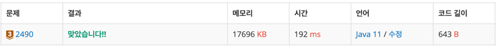

https://www.acmicpc.net/problem/2490

### 풀이 날짜
2025-05-31

### 문제 분석 요약
- 윷놀이에서 네개 윷짝 던져서 나온 숫자가 도개걸윷 중에 어떤건지 확인하는 문제
- 규칙
```
배 0개, 등 4개 → 모 (E)
배 1개, 등 3개 → 도 (A)
배 2개, 등 2개 → 개 (B)
배 3개, 등 1개 → 걸 (C)
배 4개, 등 0개 → 윷 (D)
```
### 알고리즘 설계
#### 필요한 값
- 윷짝 4개의 상태
- 배 개수 카운터
- 결과 매핑 char 배열 results

#### 풀이순서
1. 3번 반복(각줄 처리)
2. 2.배열 초기화
3. 4개 윷짝 입력받기
4. 배 개수 카운터 초기화
5. 배열을 돌며 0의 개수 세기
6. 결과 출력

### 코드
```java
import java.util.Scanner;

public class Main{
    public static void main(String[] args) {
        Scanner sc = new Scanner(System.in);
        
        for(int i = 0; i < 3; i++) {
            int[] array = new int[4];
            for (int j = 0; j < 4; j++) {
                array[j] = sc.nextInt();
            }
            
            int backCount = 0;
            for (int j = 0; j < 4; j++) {
                if (array[j] == 0) {
                    backCount++;
                }
            }
            
            char[] results = {'E', 'A', 'B', 'C', 'D'};
            System.out.println(results[backCount]);
        }
    }
}
```


### 시간 복잡도
- O(1)
    - 입력 크기가 고정 (3×4 = 12개)되어있고 반복 횟수가 12회로 상수시간 안에 해결

### 느낀점 or 기억할 정보
- 처음에는 switch문을 생각했는데 배열을 선언해서 푸는게 더 효율적이다.