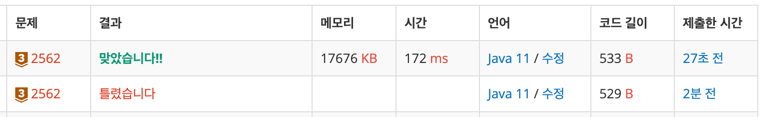

https://www.acmicpc.net/problem/2562

### 문제 풀이 날짜
2025-08-07

### 문제 분석 요약
- 9개의 서로 다른 자연수가 주어질 때, 이들 중 최댓값을 찾고 그 최댓값이 몇 번째 수인지를 구하는 문제

제약조건
- 주어지는 자연수는 100 보다 작다.
### 알고리즘 설계

#### 입력
- 9개의 숫자를 담을 정수 배열 array 선언
- 최댓값 담을 변수 `maxNum  = 0;` 선언
- 인덱스 값 담을 변수 `index = 0;`  선언
#### 연산
-  반복문을 선언해 <9 까지 입력 받아 array 배열에 저장
- `Math.max`를 사용해 최댓값과 입력받은 배열의 원소의 값과 비교해 더 큰 값을 최댓값 변수 maxNum에 저장한다
- maxNum과 배열의 원소가 같으면 인덱스 값을 index 변수에 저장한다
#### 출력
- 최댓값 변수 maxNum과 index 변수를 각각 출력한다

### 시간 복잡도
- O(1)
### 코드
```java  
import java.util.Scanner;

public class Main {
    public static void main(String[] args) {
        Scanner sc = new Scanner(System.in);
        int[] array = new int[9];
        int maxNum = 0;
        int index = 0;

        for (int i = 0; i < 9; i++) {
            array[i] = sc.nextInt();
            maxNum = Math.max(maxNum, array[i]);
            if (array[i] == maxNum) {
                index = i;
            }
        }

        // 출력
        System.out.println(maxNum);
        System.out.println(index + 1);
    }
}
```



### 느낀점 or 기억할 정보
-  index 값을 출력할때 0부터 9 까지여서 i 값을 그대로 출력하면 일치하지 않는다. index + 1 혹은 처음부터 index를 고려한 1부터 8까지와 같이 고민해 볼 수 있을것 같다.