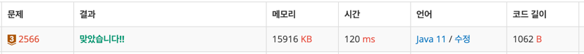

https://www.acmicpc.net/problem/2566

### 풀이 날짜
2025-06-03

### 문제 분석 요약
- 9x9 격자판에 쓰여진 81개 자연수, 0 중에 최댓값을 찾고 최댓값이 몇행 몇열에 위치한지 확인하는 문제
-  첫째 줄에 최댓값 출력, 둘째 줄에 최댓값이 위치한 행 번호, 열 번호 빈칸을 사이에 두고 차례로 출력

### 알고리즘 설계
#### 필요한 값
- 격자판의 크기는 9x9로 고정 : 2차원 배열 array
- 최댓값 maxNum;
- 최대 행과 열 위치: maxCol, maxRow
#### 풀이순서
1. 입력한 값을 담을  9x9 2차원 배열 생성
2. 2차원 배열에 각 값을 담기
3. 최대값을 찾고 위치를 찾아주기
    - array 배열의 인덱스보다 최대값이 큰 경우 인덱스 값을 최대 값으로 변경
    - 해당 값의 인덱스 i, j를 찾기

### 코드
```java
import java.io.*;
import java.util.StringTokenizer;

public class Main{
    public static void main(String[] args) throws IOException {
        // 9x9 배열 선언
        int[][] array = new int[9][9];
        
        // 2차원배열에 입력하기
        BufferedReader br = new BufferedReader(new InputStreamReader(System.in));
        for(int i = 0; i < 9; i++) {
            StringTokenizer st = new StringTokenizer(br.readLine());
            for(int j = 0; j <9; j++) {
                array[i][j] = Integer.parseInt(st.nextToken());
            }
        } 
        // 최대값과 위치 찾기
        int max = array[0][0];
        int maxRow = 0;
        int maxCol = 0;
        
        for(int i = 0; i < 9; i++){
            for(int j = 0; j < 9; j++) {
                if(array[i][j] > max) {
                    max = array[i][j];
                    maxRow = i;
                    maxCol = j;
                }
            }
        }
        System.out.println(max);
        System.out.println((maxRow + 1) + " " + (maxCol + 1));
    }
}
```



### 시간 복잡도
- O(N^2)
    - 2차원 배열을 전체 탐색하기 때문
- 최대 연산 횟수 : 81번

### 느낀점 or 기억할 정보
- 문제를 풀다보니 입력받는 방법 패턴에 대해서 정리해보게 되었다

1. 한 줄에 여러 개 숫자(공백 구분)
```java
StringTokenizer st = new StringTokenizer(br.readLine()); 
int a = Integer.parseInt(st.nextToken()); 
int b = Integer.parseInt(st.nextToken()); 
int c = Integer.parseInt(st.nextToken());
```

2. N개 만큼 한 줄씩
```java
int n = Integer.parseInt(br.readLine());
for(int i = 0; i < n; i++) { // 각 줄 처리
}
```

3. N x M 2차원 배열
```java
int n = Integer.parseInt(br.readLine()); // 행 
int m = Integer.parseInt(br.readLine()); // 열 

int[][] arr = new int[n][m];

for(int i = 0; i < n; i++) { 
	StringTokenizer st = new StringTokenizer(br.readLine()); 
	for(int j = 0; j < m; j++) { 
	arr[i][j] = Integer.parseInt(st.nextToken()); 
	} 
}
```

4. 문자열로 붙여 입력받는 경우
```java
String line = br.readLine(); 
for(int i = 0; i < line.length(); i++) {
	int num = line.charAt(i) - '0'; 
}
```