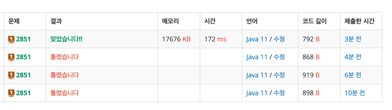

https://www.acmicpc.net/problem/2851

### 풀이 날짜
2025-09-08

### 문제 분석 요약
- 10개 버섯을 먹은 접수의 합이 최대한 100과 가까운수

제약조건
- 만약 100에 가까운 수가 2개라면 (예: 98, 102) 마리오는 큰 값을 선택한다.
### 알고리즘 설계

#### 입력
- 10개의 숫자를 입력받아 배열에 저장한다
    - 100보다 같거나 작은 정수 10개 이기 때문에 int 타입
#### 연산
- 반복문으로 배열을 순회하면서 점수를 누적으로 더해준다
- 누적으로 더한 현재의 값을 이전 누적값과 비교한다
    - 절대값을 구해 두 값중 더 작은 값을 반환
    - 두개 값이 같은 경우 더 큰 값을 반환
#### 출력
정답 변수 answer 출력

### 시간 복잡도
- O(N)
### 코드
```java  
import java.util.*;

public class Main {
    public static void main(String[] args) {
        // 입력
        Scanner sc = new Scanner(System.in);
        int[] numberArray = new int[10];

        for (int i = 0; i < 10 ; i++) {
           numberArray[i] = sc.nextInt();
        }

        // 연산
        int currentSum = 0;
        int answer = currentSum;

        for (int i = 0; i < numberArray.length ; i++) {
            currentSum += numberArray[i];

            if (Math.abs(currentSum - 100) < Math.abs(answer - 100)) {
                answer = currentSum;
            } else if (Math.abs(currentSum - 100) == Math.abs(answer - 100)) {
                answer = Math.max(currentSum, answer);
            }
        }

        // 출력
        System.out.println(answer);
    }
}

```


### 느낀점 or 기억할 정보
- 이전 값, 정답 변수를 각각 초기화 하고 업데이트 해야한다고 생각했는데 이전값 없이 바로 anwer에 현재 단계랑 전체에서 최선을 비교해서 구해야 올바른 답이 나온다