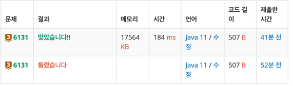

https://www.acmicpc.net/problem/6131

### 문제 풀이 날짜
2025-07-31

### 문제 분석 요약
- A의 제곱은 B의 제곱보다 N만큼 크다 (1 ≤ N ≤ 1,000)
- 위의 힌트 조건을 만족하는 A와 B 쌍의 개수를 구하는 프로그램을 작성

제약조건
- N의 범위 (1 ≤ N ≤ 1,000)
- 두 양의 정수 A와 B (1 ≤ B ≤ A ≤ 500)
### 알고리즘 설계

#### 입력
- 숫자 N을 입력받는다
#### 연산
- count 변수 선언
- A와 B를 고를 이중 반복문 선언
    - A : 1 <= A <= 500 범위의 반복문 선언
    - B : 1 <= B <= A <= 500 범위(B가 1 이상이면서 A이하인 경우 반복문 수행하도록)
- `(B * B) - (A * A) == N `  의 조건을 만족하는 경우
    - count 변수 가산 해주기

#### 출력
- (A, B) 쌍의 개수를 세는 count 변수 출력

### 시간 복잡도
- O(1)
- 500이라는 상수에 비례해서 A와 B의 연산횟수가 정해지기 때문에 총 연산횟수는 500 * 501 / 2 =  약 12만번 수행
### 코드
```java  
import java.util.Scanner;

public class Main {
    public static void main(String[] args) {
        // 입력
        Scanner sc = new Scanner(System.in);
        int N = sc.nextInt();
        
        // 연산
        int count = 0;
        for (int A = 1; A <= 500 ; A++) {
            for (int B = 1; B <= A ; B++) {
                if ((A * A) - (B * B) == N) {
                    count++;
                }
            }
        }
        
        // 출력
        System.out.println(count);
    }
}
```


### 느낀점 or 기억할 정보
- 이중반복문에서 두 양의 정수 A와 B (1 ≤ B ≤ A ≤ 500) 를 세어주는 부분을 고려하지 않아서 반복문 부분에서 틀렸다.