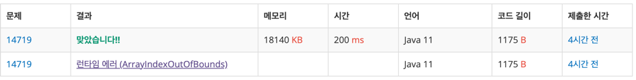

### 풀이 날짜
2025-06-13

https://www.acmicpc.net/problem/5550

### 문제 분석 요약
- 블록 사이에 고이는 빗물의 총량을 구하는 문제
- 2차원 세계의 세로 길이 H과 2차원 세계의 가로 길이 W(1 ≤ H, W ≤ 500)
-  W개만큼 블록이 쌓인 높이 있다(0 <=  높이 <= H)
- 한칸의 용량은 1
### 알고리즘 설계

#### 풀이순서
1. 정수 세로길이 H 가로 길이 W를 각각 입력받는다
2. 배열 heights를 선언해 W크기만큼 세로길이들을 입력 받는다
3. leftMax 배열을 선언해 왼쪽-> 오른쪽 순환하면서 더 큰 숫자를 배열에 저장한다
4. rightMax 배열을 선언해 오른쪽 -> 왼쪽을 순환하면서 더 큰 숫자를 배열에 저장한다
5. leftMax 배열과 rightMax 배열을 순환하면서 더 작은 값을 구한다.
6. 처음에 입력받았던 heights 배열의 원소를 순환하면서 물이 고일 수 있는지 구한다.
    - 물이 고일 수 있다면 total에 저장한다

#### 사고과정
고이는 빗물을 구하려면 빗물이 고이는 경우를 구해야 한다.  블록들을 하나의 큰 그릇이라고 생각했을때 사이에 고이는 빗물을 구하려면 왼쪽과 오른쪽의 가장 높은 높이(가장 큰 값)을 구해야 한다. 입력받은 heights 배열의 원소를 방문하면서 Math.max를 사용해 왼쪽과 오른쪽의 가장 큰 값을 구해 leftMax, rightMax 배열에 담아준다.

담긴 빗물을 계산할때는 왼쪽 블록과 오른쪽 블록 중 더 낮은쪽을 구해야 한다. 더 큰 쪽에 맞추게 되면 낮은쪽에 있는 물은 흐르기 때문에 더 낮은 쪽을 구해야 한다. 앞서 구했던 leftMax, rightMax 배열의 원소를 방문하면서 Math.min을 사용해 더 작은 값을 구한다. 그리고 물이 고일 수 있는지를 확인하고 고일 수 있다면 빈공간의 크기를 계산한다.

### 시간 복잡도
- O(W)
- 최대 연산 횟수
    - W ≤ 500이므로 leftMax, rightMax, 빗물계산을 다 했을때 1500회 정도


### 코드
```java  
import java.util.*;
import java.io.*;

public class Main {
    public static void main(String args[]) {
        Scanner sc = new Scanner(System.in);
        // 블록 H, W 담기
        int H = sc.nextInt();
        int W = sc.nextInt();

        // 건물 높이 height 배열에 담기
        int[] heights = new int[W];
        for (int i = 0; i < W; i++) {
            heights[i] = sc.nextInt();
        }

        // 왼쪽 최대 높이
        int[] leftMax = new int[W];
        leftMax[0] = heights[0];
        for (int i = 1; i < W; i++) {
            leftMax[i] = Math.max(leftMax[i-1], heights[i]);
        }

        int[] rightMax = new int[W];
        rightMax[W - 1] = heights[W - 1];
        for (int i = W - 2; i >= 0; i--) {
            rightMax[i] = Math.max(rightMax[i + 1], heights[i]);
        }

        int total = 0;
        for (int i = 1; i < W - 1; i++) {
            int waterLevel = Math.min(leftMax[i], rightMax[i]);
            if (waterLevel > heights[i]) {
                total += waterLevel - heights[i];
            }
        }
        // 최대값 반환
        System.out.println(total);
    }
}
```


### 느낀점 or 기억할 정보
- 시간복잡도를 계산할 때 사용되는 변수들을 찾아봤다.

| 변수 | 의미 | 예시 |
|---|---|---|
| **N** | 배열 크기, 데이터 개수 | `int[] arr = new int[N]` |
| **M** | 두 번째 차원, 쿼리 개수 | `int[][] arr = new int[N][M]` |
| **W** | 너비, 가로 길이 | `int W = sc.nextInt()` |
| **H** | 높이, 세로 길이 | `int H = sc.nextInt()` |
| **L** | 길이 | `String str.length()` |
| **K** | 특별한 조건, 제한 | `K번 반복` |