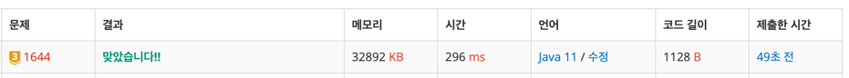

https://www.acmicpc.net/problem/1644

### 문제 풀이 날짜
2025-06-19

### 문제 분석 요약
- 자연수가 주어졌을 때, 이 자연수를 연속된 소수의 합으로 나타낼 수 있는 경우의 수를 구하는 문제
### 알고리즘 설계
- 어떤 숫자를 더해서 N이 되는데 어떤 숫자들이 소수여야 한다
- 1 ~ N에서 소수인 수를 찾는다
- 소수의 수 모임에서 연속된 수의 합이 N이 되는 숫자를 찾는다 (슬라이딩 윈도우를 활용한다)

#### 풀이순서
1. N을 입력 받는다(하나의 숫자니까 Scanner로도 충분하다)
2. 1 ~ N 까지 숫자 중 소수인 수를 판별한다
3. 소수들을 List에 저장한다
4. left=0, right=0, sum=0, count=0 초기화
6. while문으로 슬라이딩 윈도우 실행
- left right를 한 방향에서 시작
- 누적합이 N보다 작으면 right를 오른쪽으로 이동
- 누적합이 N보다 크면 left를 왼쪽으로 이동
7. count 출력

### 시간 복잡도
- O(N^2)

### 코드
```java  
import java.util.*;

public class Main {
    public static void main(String args[]) {
        Scanner sc = new Scanner(System.in);
        int N = sc.nextInt();
        
        boolean[] isPrime = new boolean[N + 1];
        Arrays.fill(isPrime, true);
        isPrime[0] = isPrime[1] = false;
        
        for (int i = 2; i * i <= N; i++){
            if (isPrime[i]){
                for (int j = i * i; j <= N; j += i) {
                    isPrime[j] = false;
                }
            }
        }
        
        List<Integer> primes = new ArrayList<>();
        for (int i = 2; i <= N; i++) {
            if (isPrime[i]){
            primes.add(i);
            }
        }
        
        int left = 0, right = 0, sum = 0, count = 0;
        while (right < primes.size()) {
            sum += primes.get(right);
            
            while (sum > N) {
                sum -= primes.get(left);
                left++;
            }
            
            if(sum == N) {
                count++;
               
            }
            right++;
        }
        System.out.println(count);
        
    }
}
```


### 느낀점 or 기억할 정보
- 소수를 구하는 공식
```java
boolean[] isPrime = new boolean[N + 1];
        Arrays.fill(isPrime, true);
        isPrime[0] = isPrime[1] = false;
        
        for (int i = 2; i * i <= N; i++){
            if (isPrime[i]){
                for (int j = i * i; j <= N; j += i) {
                    isPrime[j] = false;
                }
            }
        }

```
