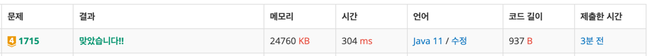

https://www.acmicpc.net/problem/1715

### 문제 풀이 날짜
2025-11-11

### 문제 분석 요약
- 여러 개의 정렬된 카드 묶음들을 하나로 합치는데 필요한 최소 비교 횟수를 구하는 문제
- 두 묶음을 합칠 때마다 (A + B)번의 비교가 발생하며, 이 비용들의 합을 최소화해야 하는 문제

### 제약조건
- 묶음의 개수 N: 1 ≤ N ≤ 100,000
- 각 묶음의 크기: 1 ≤ 크기 ≤ 1,000
### 알고리즘 설계

문제의 핵심
- 항상 가장 작은 두 묶음을 먼저 합쳐야 최소 비용이 나온다
#### 입력
- 첫째 줄: 묶음의 개수 N
- 다음 N개 줄: 각 묶음의 카드 수
#### 연산
- 모든 묶음을 최소 힙(우선순위 큐)에 넣는다
- 힙에서 가장 작은 두 묶음을 꺼낸다
- 두 묶음을 합치고, 그 크기를 비용에 더한다
- 합친 묶음을 다시 힙에 넣는다
- 힙에 묶음이 1개만 남을 때까지 반복한다

#### 출력
- 최소 비교 횟수
### 시간 복잡도
- O(N log N)

- 힙에 N개 삽입: O(N log N)
- N-1번의 합치기 작업, 각각 힙 삽입/삭제: O(log N)
- 전체: O(N log N)

### 코드
```java  
import java.util.*;
import java.io.*;

public class Main {
    public static void main(String[] args) throws IOException {
        BufferedReader br = new BufferedReader(new InputStreamReader(System.in));

        int N = Integer.parseInt(br.readLine());

        PriorityQueue<Integer> pq = new PriorityQueue<>();

        for(int i = 0; i < N; i++) {
            pq.offer(Integer.parseInt(br.readLine()));
        }

        int totalComparisons = 0;
        while (pq.size() > 1) {
            // 1. 가장 작은 2개 꺼내기
            int a = pq.poll();
            int b = pq.poll();

            // 2. 합치기
            int sum = a + b;

            // 3. 비용 누적
            totalComparisons += sum;

            // 4. 합친 값 다시 넣기
            pq.offer(sum);

        }
        System.out.println(totalComparisons);
    }
}
```



### 알게된점
- 탐욕 알고리즘: 매 순간 가장 작은 것을 선택하는 것이 전체 최적해를 만든다
- 우선순위 큐
  - 우선순위 큐는 `Arrays.sort()` 처럼 전체 값을 정렬하지는 않지만 `poll()` 했을 때 가장 작은 값을 뺀다.
  - 문제에서 누적값과 가장 작은값을 더해서 가장 작은 누적의 합을 만들어야 하기 때문에 우선순위 큐가 적절하다