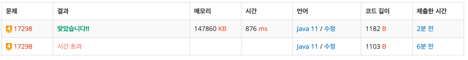

https://www.acmicpc.net/problem/17298

### 문제 풀이 날짜 
2025-11-21 

### 문제 분석 요약
- 순열 배열에 있는 값들을 순회하면서 배열의 값보다 오른쪽에 더 큰 값이 있는지 확인해서 담아주는 문제
- 오른쪽에 더 큰 값이 없으면 -1 반환

### 문제의 핵심
- 부루트포스로는 N의 크기가 100만이기 때문에 시간안에 풀 수 없다.
- 이 문제에서는 가장 나중에 들어온 값과 수열A의 값을 비교해줘야 하기 때문에 stack 자료구조로 풀면 시간 안에 문제를 해결할 수 있다.
### 제약조건
- N (1 ≤ N ≤ 1,000,000)이 주어진다.
- 수열 A의 원소 A1, A2, ..., AN (1 ≤ Ai ≤ 1,000,000)
### 알고리즘 설계

#### 입력
- 수열의 크기 int N
- 수열의 원소를 담은 int 배열 array
#### 연산
- 수열의 수를 담아줄 stack 선언
- 오큰수를 구해 담아줄 int 배열 result 선언
1. N의 크기만큼 반복문 수행
    1. stack이 비어있지 않고, stack에 제일 마지막에 들어온 원소의 값이 현재 값보다 작은 경우
    2. stack에서 값을 빼서 result배열에 값을 넣어준다
    3. stack이 비어있으면 stack에 값을 넣어준다

#### 출력
- StringBuilder을 사용해서 result 배열에 값을 붙여서 출력해준다
### 시간 복잡도
- O(N):
    - stack 자료구조를 사용해서 최대 N번만 확인해서 문제를 풀 수 있다

### 코드
```java  
import java.util.*;
import java.io.*;
public class Main {
    public static void main(String[] args) throws IOException {
        // 입력
        BufferedReader br = new BufferedReader(new InputStreamReader(System.in));
        int N = Integer.parseInt(br.readLine());

        int[] array = new int[N];
        StringTokenizer st = new StringTokenizer(br.readLine());
        for (int i = 0; i < N; i++) {
            array[i] = Integer.parseInt(st.nextToken());
        }

        // 연산
        Stack<Integer> stack = new Stack<>();
        int[] result = new int[N];

        // 배열 순회
        for (int i = 0; i < N; i++) {
            while (!stack.isEmpty() && array[stack.peek()] < array[i]) {
                int idx = stack.pop();
                result[idx] = array[i];
            }
            stack.push(i);
        }

        // 더 큰수가 없는 경우
        while(!stack.isEmpty()) {
            int idx = stack.pop();
            result[idx] = -1;
        }

		// 출력
        StringBuilder sb = new StringBuilder();
        for (int num : result) {
            sb.append(num).append(" ");
        }
        System.out.println(sb);
    }
}

```


### 알게된점

- 자료구조를 스택으로 넣어주고 시간초과가 나서 자료구조가 잘못되었나 생각했는데 보니까 출력부분에서도 일반 반복문으로 쓰면 안되는 문제였다.
- 입력이 최대 100만번이라는건 출력도 최대 100만번이라는 의미
- N의 크기가 10만 이상일때는 출력에서도 StringBuilder 사용 필요
```java

// 시간초과
for (int num : result) {
	System.out.print(num + " ");
}

// StringBuilder 사용해 통과
StringBuilder sb = new StringBuilder();
	for (int num : result) {
		sb.append(num).append(" ");
	}
	System.out.println(sb);

```
