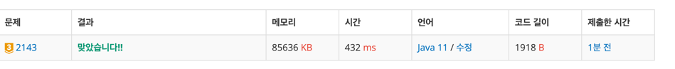

https://www.acmicpc.net/problem/2143

### 풀이 날짜
2025-06-12

### 문제 분석 요약
- 두개의 배열에서 부배열의 합이 T가 되는 부배열 쌍의 개수를 구하는 문제
- T(-1,000,000,000 ≤ T ≤ 1,000,000,000)
- n(1 ≤ n ≤ 1,000)
- m(1 ≤ m ≤ 1,000)
- 각각의 배열 원소는 절댓값이 1,000,000을 넘지 않는 정수
- 제약조건 : 가능한 경우가 한가지도 없을때 0 출력
### 알고리즘 설계
#### 필요한 값
- 부배열 합 정수 T
- 첫번째 배열 n의 크기
- n의 크기 만큼 담을
- 두번째 배열 m의 크기
#### 풀이순서
1. 확인해야 하는 배열의 쌍 개수 T 입력 받기
    - 10억 이하 이기 때문에 정수로 가능
2. A 배열과 원소 입력 받기
    - 배열 A에 n의 크기 만큼 원소를 담는다
3. B 배열과 원소 입력 받기
    - 배열 B에 m의 크기만큼 원소를 담는다
4. A 배열의 모든 부배열 합 구하기
    - 이중반복문으로 모든 가능한 경우의 수를 더해서 저장한다
5. B 배열의 모든 부배열 합 구하기
6. A의 합 + B의 합 = T가 되는 경우의 수 구하기
    - hashmap에 부배열의 합을 저장한다
    - `sumA + sumB = T` 를 찾는거니까 `sumA = T - sumB` 로 생각할 수 있다.

### 시간 복잡도
- O(N^2)
    - n, m의 크기가 최대 1000이기 때문에 N^2 를 해도 1,000,000 백만번을 한다
- 최대 연산 횟수
    - 제약조건: n ≤ 1,000, m ≤ 1,000

### 코드
```java  
import java.io.*;  
import java.util.*;  
  
public class B2143 {  
    public static void main(String[] args) throws IOException {  
        BufferedReader br = new BufferedReader(new InputStreamReader(System.in));  
        int T = Integer.parseInt(br.readLine());  
  
        // A 배열과 원소 입력 받기  
        int n = Integer.parseInt(br.readLine());  
        int[] A = new int[n];  
        StringTokenizer st = new StringTokenizer(br.readLine());  
        for (int i = 0; i < n; i++) {  
            A[i] = Integer.parseInt(st.nextToken());  
        }  
  
        // B 배열과 원소 입력 받기  
        int m = Integer.parseInt(br.readLine());  
        int[] B = new int[m];  
        st = new StringTokenizer(br.readLine());  
        for (int i = 0; i < m; i++) {  
            B[i] = Integer.parseInt(st.nextToken());  
        }  
  
        // A 배열의 모든 부배열 합 구하기  
        ArrayList<Integer> sumAList = new ArrayList<>();  
        for(int i = 0; i < n; i++) {  
            int sum = 0;  
            for(int j = i; j < n; j++) {  
                sum += A[j];  
                sumAList.add(sum);  
            }  
        }  
  
        // B 배열의 모든 부배열 합 구하기  
        ArrayList<Integer> sumBList = new ArrayList<>();  
        for(int i = 0; i < m; i++) {  
            int sum = 0;  
            for(int j = i; j < m; j++) {  
                sum += B[j];  
                sumBList.add(sum);  
            }  
        }  
  
        // A의 합 + B의 합 = T가 되는 경우의 수 구하기  
        HashMap<Integer, Integer> map = new HashMap<>();  
        for (int sumA : sumAList) {  
            map.put(sumA, map.getOrDefault(sumA, 0) + 1);  
        }  
  
        long count = 0;  
        for (int sumB : sumBList) {  
            int targetSumA = T - sumB;  
  
            if (map.containsKey(targetSumA)) {  
                count += map.get(targetSumA);  
            }  
        }  
        System.out.println(count);  
    }  
}
```


### 느낀점 or 기억할 정보
- A 배열 모든 부배열 합 구하는것과 B배열 모든 부배열 합 구하는 거랑 소스가 거의 동일해서 문제는 통과했지만 메서드를 분리할 수 있을것 같아서 찾아봤다
```java 
public static ArrayList<Integer> getSubarraySums(int[] arr) {  
    ArrayList<Integer> sums = new ArrayList<>();  
    for(int i = 0; i < arr.length; i++) {  
        int sum = 0;  
        for(int j = i; j < arr.length; j++) {  
            sum += arr[j];  
            sums.add(sum);  
        }  
    }  
    return sums;  
}
```

- main에서는 아래와 같이 간단하게 호출할 수 있다
``` java
ArrayList<Integer> sumAList = getSubarraySums(A);  
ArrayList<Integer> sumBList = getSubarraySums(B);
```