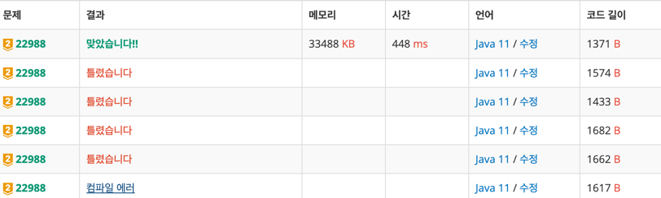

https://www.acmicpc.net/problem/22988

### 문제 풀이 날짜
2025-06-20

### 문제 분석 요약
- 에센스 용기를 담아서 꽉찬 용기로 만들 수 있는 개수를 찾는 문제


### 알고리즘 설계
- 투포인터 알고리즘을 사용해서 풀어야 한다고 생각이 들었다. 연속된 수라는 말이 없어서 슬라이딩 윈도우가 아닌 일반 투포인터 알고리즘을 사용해야 한다
- 투포인터 알고리즘을 사용해서 풀기 전에 문제에서 X(이미 꽉 찬 에센스)를 제외하는 부분이 추가적으로 필요하다
```text
// 수도코드로 작성해본 꽉 찬 에센스를 제외하는 로직
입력_분류(용기들, X):
    완성된_개수 = 0
    미완성_용기들 = []
    
    FOR EACH 용기 IN 용기들:
        IF 용기.용량 == X:
            완성된_개수++
        ELSE:
            미완성_용기들.추가(용기.용량)
    
    RETURN 완성된_개수, 미완성_용기들
```
- 두 용기 A, B를 교환할 때: min(A + B + X/2, X)
- 꽉 찬 용기(X)가 되려면: A + B + X/2 ≥ X  ->  A + B ≥ X/2
- 미완성 용기들을 정렬한 후 투포인터 적용
-  양 끝에서 시작해서 조건 확인 - 만약 두 용기의 합이 X/2 이상이면 → 꽉 찬 용기 1개 완성
-  그렇지 않으면 → 작은 쪽 포인터만 이동 (큰 쪽은 다른 용기와 재시도)

### 시간 복잡도
- O(N log N)

### 코드
```java  
import java.util.*;
import java.io.*;

public class Main {
    public static void main(String args[]) throws IOException {
        BufferedReader br = new BufferedReader(new InputStreamReader(System.in));
        StringTokenizer st = new StringTokenizer(br.readLine());
        
        int N = Integer.parseInt(st.nextToken());
        long X = Long.parseLong(st.nextToken()); 
        long min = (X + 1) / 2;
        
        long[] bottles = new long[N];  
        int bottleCount = 0;
        int answer = 0;
        
        st = new StringTokenizer(br.readLine());
        for (int i = 0; i < N; i++) {
            long capacity = Long.parseLong(st.nextToken());
            if (capacity >= X) { 
                answer++;
            } else {
                bottles[bottleCount++] = capacity;
            }
        }
        
        Arrays.sort(bottles, 0, bottleCount);
        
        int left = 0;
        int right = bottleCount - 1;
        int remain = bottleCount;
        
        while (left < right) {
            long sum = bottles[left] + bottles[right];
            if (sum >= min) {
                answer++;
                left++;
                right--;
                remain -= 2;
            } else {
                left++;
            }
        }
        
        answer += remain / 3;
        
        System.out.println(answer);
    }
}
```



        
### 느낀점 or 기억할 정보
- 이 문제에서 양쪽으로 포인터를 동시에 제거해주는게 처음 적용해보는 로직이었다
```java
while (left < right) { 
	if (sum >= min) { 
		answer++; left++; right--; // 양쪽 소모 
	} else { 
		left++; // 작은 쪽만 버림 (큰 쪽은 보존) } }
```