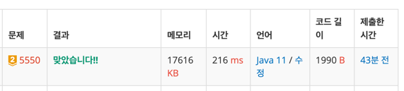

https://www.acmicpc.net/problem/5550

### 문제 분석 요약
- 책 N권의 기준 가격과 장르 번호가 주어질때 책의 총 매입가격의 최댓값을 구하는 문제
### 알고리즘 설계
#### 필요한 값
- 상근이가 가지고 있는 책의 개수 N, 팔려고 하는 책의 개수 K  (2 ≤ N ≤ 2000, 1 ≤ K < N)
    - 둘다 정수
-  장르, 가격을 담을 genreList arraylist
- 2차원 dp 배열
#### 풀이순서
- 입력받고 전처리
1. 상근이가 가지고 있는 책의 개수 정수 N 입력받기
2. 팔려고 하는 책 정수 K, 책의 개수 N만큼 책을 입력 받는다
3. 1-10 장르별로 입력하기 위한 외부 arraylist 선언
4. N개의 책 정보(가격, 장르)를 입력받아 장르별로 분류
5. 각 장르 내에서 가격 내림차순 정렬 (비싼 책부터 선택하기 위해)

- DP 초기화
1. 2차원 DP 테이블 생성: `dp[장르][책수] = 최대 매입가`
2. 장르 1번부터 10번까지 반복
    - 현재 장르의 책 리스트 가져오기
    - 이전 장르 결과를 현재 장르에 복사 (0권 선택 케이스)
    - 현재 장르에서 선택 가능한 최대 권수 계산
    - 현재 선택 권수에 대한 수익 계산
    - 모든 가능한 총 책수에 대해 점화식 `dp[현재장르][총책수] = max(기존값, 이전상태 + 현재장르수익)`
3. K권 선택했을 때 최대값 `dp[10][K]` 출력

### 시간 복잡도
- O(N log N + K²)
    - K < N 이지만 N과 K는 같지않다
- 최대 연산 횟수
    - K ≤ 2000이므로 → 10 × 4백만 = 4천만


### 코드
```java  
import java.io.*;  
import java.util.*;  
  
public class B2143 {  
    public static void main(String[] args) throws IOException {  
        BufferedReader br = new BufferedReader(new InputStreamReader(System.in));  
        int T = Integer.parseInt(br.readLine());  
  
        // A 배열과 원소 입력 받기  
        int n = Integer.parseInt(br.readLine());  
        int[] A = new int[n];  
        StringTokenizer st = new StringTokenizer(br.readLine());  
        for (int i = 0; i < n; i++) {  
            A[i] = Integer.parseInt(st.nextToken());  
        }  
  
        // B 배열과 원소 입력 받기  
        int m = Integer.parseInt(br.readLine());  
        int[] B = new int[m];  
        st = new StringTokenizer(br.readLine());  
        for (int i = 0; i < m; i++) {  
            B[i] = Integer.parseInt(st.nextToken());  
        }  
  
        // A 배열의 모든 부배열 합 구하기  
        ArrayList<Integer> sumAList = new ArrayList<>();  
        for(int i = 0; i < n; i++) {  
            int sum = 0;  
            for(int j = i; j < n; j++) {  
                sum += A[j];  
                sumAList.add(sum);  
            }  
        }  
  
        // B 배열의 모든 부배열 합 구하기  
        ArrayList<Integer> sumBList = new ArrayList<>();  
        for(int i = 0; i < m; i++) {  
            int sum = 0;  
            for(int j = i; j < m; j++) {  
                sum += B[j];  
                sumBList.add(sum);  
            }  
        }  
  
        // A의 합 + B의 합 = T가 되는 경우의 수 구하기  
        HashMap<Integer, Integer> map = new HashMap<>();  
        for (int sumA : sumAList) {  
            map.put(sumA, map.getOrDefault(sumA, 0) + 1);  
        }  
  
        long count = 0;  
        for (int sumB : sumBList) {  
            int targetSumA = T - sumB;  
  
            if (map.containsKey(targetSumA)) {  
                count += map.get(targetSumA);  
            }  
        }  
        System.out.println(count);  
    }  
}
```


### 느낀점 or 기억할 정보
- 처음에 2차원배열 누적합으로 풀었던 문제랑 똑같은 방법으로 풀어야 하는지 생각을 했는데 계산하는 방법이 생각이 안나서 찾아봤는데 누적합 개념을 활용한 DP 문제였다. 