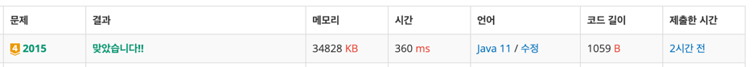

https://www.acmicpc.net/problem/2015

### 풀이 날짜
2025-06-09

### 문제 분석 요약
- N개의 정수가 저장되어 있는 배열에서 **부분합이 K인 구간이 몇 개인지** 구하는 문제
- 제약조건 : **N ≤ 200,000**
### 알고리즘 설계
#### 필요한 값
- 정수 N, K
- N의 개수만큼 담을 배열 A
- 누적합을 담을 long 타입 변수 prefixSum
    - 최악의 경우 누적합은 200만까지 될 수 있어 long 타입 필요
- 누적합 담을 map

- 문제에서 제약조건에서 N ≤ 200,000 이라는 조건이 있어 시간복잡도 N^2로는 시간 초과가 된다. 그래서 O(N), 혹은 O(N log N) 알고리즘이 필요하다는 것을 생각해야 한다.
- 부분합을 사용해야 하는 구간에서 누적합 을 떠올리고 아래 누적합 공식을 떠올린다.
  누적합의 원리 : 마지막 인덱스 - (처음 인덱스 - 1) = 구간의 합
  ```java
  부분합 A[i]~A[j] = prefix[j] - prefix[i-1]
  ```

  수식을 변형해서 현재 위치에서 이전에 값이 있었는지를 찾아줘야 한다.
  ```java
  prefix[j] - prefix[i-1] = K
  ↓ 
  prefix[i-1] = prefix[j] - K
  ```
- 같은 누적합이 여러번 나올 수 있어서 HashMap을 활용해서 세어준다.
#### 풀이순서
1. N과 K를 입력받는다
2. N개의 정수를 배열 A에 담는다
3. HashMap을 생성하고 누적합 0을 1개로 초기화한다
4. 누적합 변수(prefixSum)와 결과변수(result)를 0으로 초기화한다
5. 배열을 순회한다
    - 현재 원소를 누적합에 더한다
    - (현재 누적합 - K) 값이 몇번 나타났는지 확인해 결과에 더한다
    - 현재 누적합을 HashMap에 기록한다
6. 결과를 출력한다

### 코드
```java
import java.util.*;
import java.io.*;

public class Main {
    public static void main(String[] args) throws IOException {
        BufferedReader br = new BufferedReader(new InputStreamReader(System.in));
        StringTokenizer st = new StringTokenizer(br.readLine());
        
        int N = Integer.parseInt(st.nextToken());
        int K = Integer.parseInt(st.nextToken());
        
        int[] A = new int[N];
        st = new StringTokenizer(br.readLine());
        for (int i = 0; i < N; i++) {
            A[i] = Integer.parseInt(st.nextToken());
        }
        
        Map<Long, Integer> map = new HashMap<>();
        map.put(0L, 1); // 누적합 값 저장할 맵 
        
        long result = 0; //최종 결과 변수
        long prefixSum = 0; // 누적합 변수
        
        for (int i = 0; i < N; i++) {
            prefixSum += A[i];
            
            result += map.getOrDefault(prefixSum - K , 0);
            map.put(prefixSum, map.getOrDefault(prefixSum, 0) + 1);
        }
        System.out.println(result);
    }
}

```



### 시간 복잡도
- O(N): 한 번의 순회로 모든 부분합 확인
- 최대 연산 횟수
    - N = 200,000
    - 각 원소의 절대값 <= 10,000
    - 최악의 경우 200,000 × 10,000 = 2,000,000,000

### 느낀점 or 기억할 정보
- 누적합 문제 패턴
```java
Map<누적합값, 등장횟수> map = new HashMap<>();
for (각 위치에서) {
    누적합 계산;
    조건을 만족하는 이전 위치들 찾기;
    현재 누적합을 map에 기록;
}
```