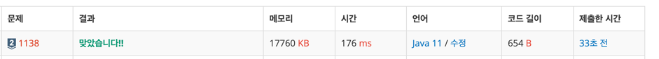

https://www.acmicpc.net/problem/1138

### 문제 풀이 날짜
2025-11-13

### 문제 분석 요약
- N명의 사람들이 자기보다 큰 사람이 왼쪽에 몇명 있었는지 값을 가지고 있다.
- 줄을 설때 어떻게 줄 서야 하는지 출력하는 문제

### 제약조건
- N은 10보다 작거나 같은 자연수
- i번째 수는 0보다 크거나 같고, N-i보다 작거나 같다
- i는 0부터 시작
### 알고리즘 설계

문제의 핵심
- 자기보다 큰 사람이 몇명 있는지에 입력한다
#### 입력
- 첫째줄 사람의 수 N
- 둘째줄에 자기보다 큰 사람 입력
#### 연산
- 키를 N부터 1까지 역순으로 확인하면서 반복
- 키에 해당하는 왼쪽의 큰 사람 수 읽기
- 현재 줄의 그 위치에 키를 끼워넣기
- 최종 줄 출력

#### 출력
- 줄 선 순서대로 출력
### 시간 복잡도
- O(N^2)
    - 처음에 N개만큼 탐색해서 O(N)이라고 생각했는데 list.add()에서 최악의 경우도 N만큼 탐색하기 때문에 `O(N) * O(N)`으로 `O(N^2)`의 시간복잡도가 나올 수 있다
    - 다만 이문제서 N의 값이 10미만으로 매우작고 시간제한이 2초이기 때문에 시간 안에 연산을 할 수 있다.

### 코드
```java  
import java.util.*;

public class Main {
    public static void main(String[] args) {
        
        // 입력
        Scanner sc = new Scanner(System.in);

        int N = sc.nextInt();

        int[] numArray = new int[N];
        for (int i = 0; i < N ; i++) {
            numArray[i] = sc.nextInt();
        }

        ArrayList<Integer> list = new ArrayList<>();

        // 연산
        for (int i = N; i >= 1; i--) {
            int count = numArray[i - 1];
            list.add(count, i); // count 위치에 i를 삽입
        }

        // 출력
        for (Integer num : list) {
            System.out.print(num + " ");
        }
    }
}
```



### 알게된점
- `ArrayList.add(index, element)` 를 사용해 원하는 곳에 값을 넣을 수 있다
    - `add(element)`: 맨 뒤에 추가
    - `add(index, element)`: index 위치에 끼워넣기
        - 기존 원소들은 자동으로 뒤로 밀린다

```java
// list 출력하는법
for (int i = 0; i < list.size(); i++) {  
    System.out.print(list.get(i) + " ");  
}

// enhanced for 문으로 출력
for (Integer integer : list) {  
    System.out.print(integer + " ");  
}
```

