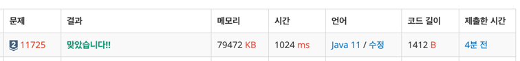

https://www.acmicpc.net/problem/11725

### 문제 풀이 날짜
2025-11-07

### 문제 분석 요약
- 루트 없는 트리가 주어진다. 이때, 트리의 루트를 1이라고 정했을 때, 각 노드의 부모를 구하는 프로그램

### 제약조건
- 노드의 개수 N (2 ≤ N ≤ 100,000)
- 둘째 줄부터 N-1
### 알고리즘 설계

문제의 핵심
- DFS(깊이 우선 탐색)로 트리 순회하면서 부모 기록
```
연결:
1 - 6
6 - 3
3 - 5
1 - 4
4 - 2
4 - 7

트리 구조:
       1
      / \
     6   4
    /   / \
   3   2   7
  /
 5

부모:
2번의 부모: 4
3번의 부모: 6
4번의 부모: 1
5번의 부모: 3
6번의 부모: 1
7번의 부모: 4
```

#### 입력
- 노드의 개수 n
- ArrayList에 각 연결 부분을 담는다 (각 노드마다 연결 개수가 다르기 때문에 가변적인 ArrayList에 담는다)
#### 연산
- 1번(루트)에서 시작
- 연결된 노드 방문
- 방문할 때 "현재 노드가 부모"라고 기록
- 재귀로 계속 탐색

#### 출력
- 첫째 줄부터 N-1개의 줄에 각 노드의 부모 노드 번호를 **2번 노드부터 순서대로** 출력한다
### 시간 복잡도
- O(N)
    - 재귀의 시간복잡도 = 함수 호출 횟수 × 함수 내부 작업량
    - 최악의 경우에도 연결된 간선만큼 방문하기 때문에 O(N)

### 코드
```java  
import java.io.*;
import java.util.*;

public class Main {
    static int[] parents;
    
    public static void main(String[] args) throws IOException {
        BufferedReader br = new BufferedReader(new InputStreamReader(System.in));
        
        int n = Integer.parseInt(br.readLine());
        
        // 트리 초기화
        ArrayList<Integer>[] tree = new ArrayList[N + 1];
        for (int i = 1; i <= n; i++) {
            tree[i] = new ArrayList<>();
        }
        
        // 부모 배열 초기화
        parents = new int[n + 1];
        
        // 간선 입력
        for (int i = 0; i < n - 1; i++) {
            StringTokenizer st = new StringTokenizer(br.readLine());
            int a = Integer.parseInt(st.nextToken());
            int b = Integer.parseInt(st.nextToken());
            
            // 양방향 연결
            tree[a].add(b);
            tree[b].add(a);
        }
        
        // 루트(1번)에서 DFS 시작
        dfs(1, 0);  // 1번의 부모는 없으므로 0
        
        // 2번부터 N번까지 부모 출력
        StringBuilder sb = new StringBuilder();
        for (int i = 2; i <= n; i++) {
            sb.append(parents[i]).append('\n');
        }
        System.out.print(sb);
    }
    
    static void dfs(int current, int parent) {
        parents[current] = parent;
        
        // 현재 노드와 연결된 모든 노드 방문
        for (int next : tree[current]) {
            // 부모 노드로는 다시 가지 않음
            if (next != parent) {
                dfs(next, current);
            }
        }
    }
}
```



### 알게된점

- 원리를 이해하고 여러번 풀어서 탐색방법을 익히기