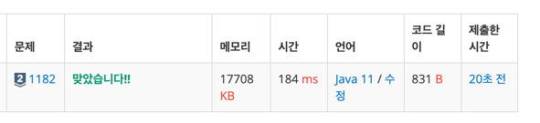

https://www.acmicpc.net/problem/1182

### 문제 풀이 날짜
2025-07-01

### 문제 분석 요약
- N개의 정수로 이루어진 수열
- 크기가 양수인 부분수열 중에서 수열의 원소를 다 더한 값이 S가 되는 경우의 수를 구하는 문제

제약조건
- 정수 N과 S (1 ≤ N ≤ 20, |S| ≤ 1,000,000)
- 주어지는 정수의 절댓값은 100,000을 넘지 않는다
### 알고리즘 설계

#### 입력
- 정수 N, S를 입력받는다
- N개의 정수를 입력받아 배열에 저장 (arr)

#### 연산
백트래킹 설정
- 현재 탐색 위치 나타내는 index(0부터 시작)
- 현재까지의 부분수열 합 나타내는 currentSum
- 경우의 수 세는 변수

백트래킹 탐색
- 각 원소에 대해 포함, 미포함 재귀적으로 탐색
- 모든 원소를 확인 했을 때 (index == N)
    - 현재 합이 S와 같고, 선택한 원소 1개 이상이면 count 증가
- 재귀 호출
    - 현재 원소를 포함하지 않는 경우: backtrack(index + 1, currentSum)
    - 현재 원소를 포함하는 경우: backtrack(index + 1, currentSum + arr[index])

#### 출력
- 부분수열의 개수(count) 출력

### 시간 복잡도
O(2^N)

### 코드
```java  
import java.util.*;

public class Main {
    static int N, S;
    static int[] arr;
    static int count = 0;

    public static void main(String[] args) {
        // 입력
        Scanner sc = new Scanner(System.in);
        N = sc.nextInt();
        S = sc.nextInt();
        arr = new int[N];
        for (int i = 0; i < N ; i++) {
            arr[i] = sc.nextInt();
        }

        //
        backtrack(0 , 0, 0);
        System.out.println(count);
    }

    static void backtrack(int index, int currentSum, int selectedCount) {
        if (index == N) {
            if (currentSum == S && selectedCount > 0) {
                count++;
            }
            return;
        }

        backtrack(index + 1, currentSum, selectedCount);

        backtrack(index + 1, currentSum + arr[index], selectedCount + 1);
    }
}
```


### 느낀점 or 기억할 정보
재귀개념이 아직 익숙하지 않아서 이 문제가 기본문제여서 여러번 풀어봐야 될 것 같다.