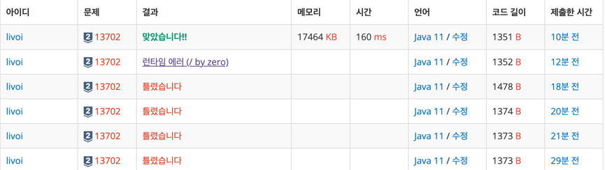

https://www.acmicpc.net/problem/13702

### 문제 풀이 날짜
2025-06-27

### 문제 분석 요약
- 같은 용량의 주전자에 담긴 용량은 각각 다르다
- N개 막걸리 주전자, K명에게 나눠줄 때 K명에게 최대한의 많은 양의 막걸리를 분배할 수 있는 용량을 출력하는 문제

제약조건
- N은 10000이하의 정수
- K는 1,000,000이하의 정수
- 막걸리 용량은 `2^31-1` 보다 작거나 같은 자연수
    - 자바에서 int 범위는 `-2^31-1 ~ 2^31-1`
- 항상 N ≤ K (주전자 개수보다 사람 수가 많을 수 없다)
### 알고리즘 설계

#### 입력
- 주전자 개수 N, 친구 K 입력받는다
- N만큼 막걸리 용량을 입력 받고 배열에 넣는다(liquors)
    - 입력받은 막걸리 용량 중 최대값을 함께 구한다(Math.max)

#### 연산
이분탐색 설정
- 막걸리 나눠주는 양을 start = 0, end = max 로 설정한다(막걸리 용량이 0이 제일 작아서)
- 제일 작은 막걸리 양(start) 부터 제일 많은 양(end = max) 보다 작을동안 탐색한다
- mid = (start + end / 2) -> 중간높이를 매번 구해준다

막걸리 용량 계산
- 모든 막걸리를 확인한다
    - 각 막걸리 용량 / 중간용량 을 누적해서 더해준다
    - 합계는 long 타입으로 선언
- 누적해서 더한 값이 친구보다 큰 경우
    - 결과값으로 저장한다
    - 더 큰 막걸리 용량이 있는지 확인하기 위해 mid = start + 1 해준다
- 누적해서 더한 값이 친구보다 작은 경우
    - 더 작은 값을 탐색한다	(mid = end - 1;)
#### 출력
- 최대 막걸리의 용량을 출력해준다

### 시간 복잡도
- O(nLogV)
- 막걸리의 용량에

### 코드
```java  
import java.util.*;
import java.io.*;
public class Main {
    public static void main(String[] args) throws IOException {
        BufferedReader br = new BufferedReader(new InputStreamReader(System.in));
        StringTokenizer st = new StringTokenizer(br.readLine());

        // 막걸리 용량, 나눠마실 친구 입력받기
        int N = Integer.parseInt(st.nextToken());
        int K = Integer.parseInt(st.nextToken());

        // 각각 용량 입력받을 배열 선언 하고 막걸리 용량 중 최댓값 구하기
        int[] liquors = new int[N];
        int maxVolumn = 0;
        for (int i = 0; i < N; i++) {
            liquors[i] = Integer.parseInt(br.readLine());
            maxVolumn = Math.max(maxVolumn, liquors[i]);
        }

        // 이분탐색
        // 막걸리 용량들을 순회하면서 중간 값으로 나눴을때 K 보다 큰지를 찾기
        long start = 1, end = maxVolumn, result = 0;

        while (start <= end) {
            long mid = (start + end) / 2;
            long sum = 0;
            for (int liquor : liquors) {
                sum += (liquor / mid);
            }

            if (sum >= K) {
                result = mid;
                start = mid + 1;
            } else {
                end = mid - 1;
            }
        }
        System.out.println(result);
    }
}

```


- N과 K의 범위가 int라는 것은 확인 했는데, 탐색할 때 누적합은 int 초과인 부분을 놓쳤다.
- 막걸리의 용량이 0과 같거나 크다고 해서 start = 0 으로 설정했는데, 이 경우 /0 으로 나누는 ArithmeticException이 나타난 다는 것을 까먹었다.
- 이분 탐색할때 start + end 가 long 타입이 될 수 있어서 mid가 long 타입이 될 수 있다.
- 이런 경우 mid만 long 타입으로 하면 타입 캐스팅을 여러 곳에서 해줘야 해서 start, end를 long으로 해버리는게 손쉬운 방법


### 느낀점 or 기억할 정보
- Q 이분탐색에서 어떤 경우에 정렬을 하고 어떤 경우에는 정렬을 하지 않아도 되는지 ?
  - 배열에서 값 찾기를 하는 경우 중간값과 비교해서 왼쪽/오른쪽 중 어디로 갈지를 결정할 수 있다
  - 오늘 문제와 같이 값을 구하는 경우는 해당 없음
- Q 단, 항상**N ≤ K** 가 문제풀때 어떤 의미인지?
  - 최대로 나눠줄 수 있는 양 = 가장 큰 주전자 용량을 보장