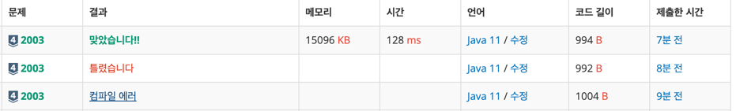

https://www.acmicpc.net/problem/2003

### 문제 풀이 날짜
2025-06-17

### 문제 분석 요약
- N개의 수로 된 수열 A에서 `A[i] ~ A[j]` 수까지의 합이 M이 되는 경우의 수를 구하는 문제
- 제약조건 :
    - N(1 ≤ N ≤ 10,000), M(1 ≤ M ≤ 300,000,000)
    - 각각의 `A[x]`는 30,000을 넘지 않는 자연수
### 알고리즘 설계

이 문제는 투포인터 알고리즘을 사용하지만 어제 문제와는 다르게 슬라이딩 윈도우를 사용해서 풀어야 하는 문제이다.

슬라이딩 윈도우의 개념
- 윈도우(구간)을 늘렸다 줄였다 하면서 조건에 맞는 구간 찾기

- 일반적인 투포인터 문제
    - 두 다른 위치의 원소 조합 -> 포인터가 각각 양쪽 끝에서 시작한다
    - 정렬과정이 필요하다
```
ai + aj = x (1 ≤ i < j ≤ n)을 만족하는 (ai, aj)쌍의 수를 구하는 프로그램
```

- 슬라이딩 윈도우로 풀어야 하는 문제
    - 연속된 구간 처리 -> 포인터가 한쪽 방향에서 시작해야 한다
    - 연속된 부분 배열의 합
```
이 수열의 i번째 수부터 j번째 수까지의 합 A[i] + A[i+1] + … + A[j-1] + A[j]가 M이 되는 경우
```

#### 필요한 값
- 입력
    - 정수 N, M
    - N의 크기의 배열
- 연산
    - 포인터 : left right
    - i ~ j 까지의 합을 담아 줄 변수
- 출력
    - M이 되는 경우의 수를 세어줄 변수

#### 풀이순서
1. 정수 N,  M을 입력 받는다
2. 배열을 선언하고 N의 크기만큼 배열에 넣어준다
3. 배열을 순회할 포인터를 선언한다
    - 순회하는 조건 : 오른쪽 포인터 < N
    - 배열의 오른쪽 포인터 값을 누적하면서 배열의 합이 M과 일치하는지 확인한다
    - 배열 원소 누적합이 목표 M보다 크면 왼쪽 포인터를 오른쪽으로 이동한다 (윈도우 축소)
    - 일치하는 경우 count 변수에 가산해준다

### 시간 복잡도
- O(N)
- 최대 연산 횟수(투포인터 알고리즘에서)
    - N = 10,000일 때:
        - 왼쪽 포인터, 오른쪽 포인터 각각 N의 크기만큼 연산 -> 20000만번

### 코드
```java  
import java.util.*;
import java.io.*;

public class Main {
    public static void main(String args[]) throws IOException {
        BufferedReader br = new BufferedReader(new InputStreamReader(System.in));
        StringTokenizer st = new StringTokenizer(br.readLine());
        
        int N = Integer.parseInt(st.nextToken());
        int M = Integer.parseInt(st.nextToken());
        int[] numberArray = new int[N];
        
        st = new StringTokenizer(br.readLine());
        for (int i = 0 ; i < N; i++) {
            numberArray[i] = Integer.parseInt(st.nextToken());
        }
        
        int left = 0, right = 0, count = 0, sum = 0;
        
        while (right < N ) {
            sum += numberArray[right];
            
            while (sum > M) {
                sum -= numberArray[left++];
            }
            
            if (sum == M) {
               count++;
            }
            right++;
            
        }
        System.out.println(count);
    }
}
```


### 느낀점 or 기억할 정보
- 같은 타입은 한번에 선언할 수 있다
```java
int left = 0, right = 0, count = 0, sum = 0;
```
