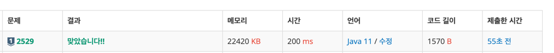

https://www.acmicpc.net/problem/2529

### 문제 풀이 날짜
2025-06-30

### 문제 분석 요약
- k개의 < , > 두개 부등호 앞뒤로 한 자릿 수 숫자를 배치해서 최댓값과 최솟값을 구하는 문제

제약조건
- k의 범위: 2 ≤ k ≤ 9
- 선택된 숫자는 모두 달라야 한다
- 부등호 기호 앞뒤에 넣을 수 있는 숫자는 0부터 9까지의 정수
### 알고리즘 설계

#### 입력
- 부등호 개수 k를 입력받는다
- k개의 부등호 기호를 입력받고 char 배열에 저장한다 (operators)

#### 연산
백트래킹 설정
- 숫자 사용 여부를 추적할 boolean 배열 `used[10]` 선언
- 모든 가능한 결과를 저장할 `List<String> results` 선언

백트래킹 탐색
- 기저 조건: depth가 k와 같으면 완성된 수를 결과 리스트에 추가
- 다음 숫자 선택: 0~9 중 아직 사용하지 않은 숫자들을 시도
- 유효성 검사: 부등호 조건을 만족하는지 확인
    - '<': 이전 숫자 < 다음 숫자
    - '>': 이전 숫자 > 다음 숫자
- 선택 → 재귀 호출 → 되돌리기 과정 반복
#### 출력
- 결과 리스트의 마지막 원소를 최댓값으로 출력
- 결과 리스트의 첫 번째 원소를 최솟값으로 출력

### 시간 복잡도
- O(10^k)
    - 백트래킹 문제에서 탐색이 많은데도 가능한건 가지치기처럼 전체를 탐색하는게 아니기 때문에 사용가능
### 코드
```java  
import java.io.*;
import java.util.*;

public class Main {
    static int k;
    static char[] operators;
    static boolean[] used = new boolean[10];
    static List<String> results = new ArrayList<>();

    public static void main(String[] args) throws IOException {
        BufferedReader br = new BufferedReader(new InputStreamReader(System.in));
        k = Integer.parseInt(br.readLine());

        StringTokenizer st = new StringTokenizer(br.readLine());
        operators = new char[k];
        for (int i = 0; i < k; i++) {
            operators[i] = st.nextToken().charAt(0);
        }

        for (int i = 0; i <= 9; i++) {
            used[i] = true;
            backtrack(i , 0, i + "");
            used[i] = false;
        }

        System.out.println(results.get(results.size() - 1)); // 최댓값
        System.out.println(results.get(0)); // 최솟값
    }

    static void backtrack(int currentNum, int depth, String number){
        if (depth == k) {
            results.add(number);
            return;
        }

        for (int nextNum = 0; nextNum <= 9 ; nextNum++) {
            if (!used[nextNum] && isValidChoice(currentNum, nextNum, operators[depth])) {
                used[nextNum] = true;

                backtrack(nextNum, depth + 1, number + nextNum);

                used[nextNum] = false;
            }
        }
    }

    private static boolean isValidChoice(int prev, int next, char operator) {
        if (operator == '<') {
            return prev < next;
        } else {
            return prev > next;
        }
    }
}
```

- 백트래킹 문제는 대부분 작은 숫자가 주어져서 Scanner로도 충분한 경우가 많다.
- scanner로도 다시 풀어보기

### 느낀점 or 기억할 정보
- 백트래킹의 핵심 아이디어
```
1. 한 걸음씩 앞으로 가기 (선택하기) 
2. 막다른 길이면 한 걸음 뒤로 가기 (선택 취소) 
3. 다른 선택지 시도하기 
4. 해답을 찾거나 모든 경우를 시도할 때까지 반복
```