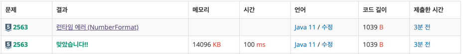

### 문제 풀이 날짜 
2025-10-11

#algorithm

https://www.acmicpc.net/problem/2563
### 문제 분석 요약
- 가로, 세로의 크기가 각각 100인 정사각형 모양의 흰색 도화지
- 가로, 세로의 크기가 각각 10인 정사각형 모양의 검은색 색종이를 색종이의 변과 도화지의 변이 평행하도록 붙일때 색종이가 붙은 검은 영역의 넓이를 구하는 프로그램

나만의 언어
- 색종이의 검은영역을 표시할 boolean 배열에 영역을 true로 표시해서 크기를 세어준다
- 겹치는 부분은 고려하지 않아도 되는데 boolean 배열에 true로 이미 되어있어도 true로 표시할 수 있어서 세어줄때 이중으로 세어지지 않는다
### 제약조건
- 색종이의 수는 100 이하이며, 색종이가 도화지 밖으로 나가는 경우는 없다
### 알고리즘 설계

#### 변수
-  `paper[][]`: 도화지를 나타내는 2차원 배열 (boolean, 크기 100×100)
- `n`: 색종이 개수 (int)
- `area`: 검은 영역의 넓이 (int, 초기값 0)
#### 입력
- 색종이 개수 n
- 각 색종이의 위치 `(x, y)`: 왼쪽 변과의 거리, 아래쪽 변과의 거리

#### 연산
- 100×100 크기의 boolean 배열 `paper` 생성 (기본값 false)
- n개의 색종이에 대해 반복:
    - 색종이의 위치 (x, y) 입력받기
    - 색종이가 차지하는 영역 표시:
        - x부터 x+10 미만까지 (가로 방향)
        - y부터 y+10 미만까지 (세로 방향)
        - 해당 위치의 paper 배열을 true로 설정
- 모든 색종이 배치가 끝난 후
    - paper 배열 전체 순회
    - true인 칸의 개수를 세어 area에 누적
    - area 값 반환

#### 출력
- 검은 영역의 넓이 (area)

### 시간 복잡도
- O(N)

### 코드
```java  
import java.util.*;
import java.io.*;

public class Main {
    public static void main(String[] args) throws IOException {
        // 입력
        BufferedReader br = new BufferedReader(new InputStreamReader(System.in));
        
        boolean[][] paper = new boolean[100][100];
        int n = Integer.parseInt(br.readLine());
        
        for (int i = 0; i < n; i++) {
            StringTokenizer st = new StringTokenizer(br.readLine());
            int x = Integer.parseInt(st.nextToken());
            int y = Integer.parseInt(st.nextToken());
            
            // 연산
            for(int row = x; row < x + 10; row++) {
                for(int col = y; col < y + 10; col++) {
                    paper[row][col] = true;
                }
            }
        }
        
        int area = 0;
        for (int i = 0; i < 100; i++) {
            for(int j = 0; j < 100; j++){
                if(paper[i][j]) area++;
            }
        }
        
        
        // 출력
        System.out.println(area);
    }
}
```


### 알게된점
- StringTokenizer은  해당 줄의 데이터만 가지고 있어서 사용할 반복문 안에서 선언해줘야 한다.