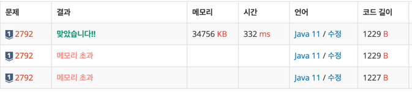

#algorithm

https://www.acmicpc.net/problem/22988
### 문제 분석 요약
- N명의 학생에게 M가지 색상의 보석을 나누어줌
- 각 학생은 같은 색상의 보석만 받을 수 있음
- 질투심 = 가장 많은 보석을 받은 학생의 보석 개수
- 목표: 질투심을 최소화
    - 모든 아이가 비슷하게 받을 경우 질투심이 최소화됨

제약조건
- 1 ≤ N ≤ 10^9, 1 ≤ M ≤ 300,000, M ≤ N

### 알고리즘 설계
처음에 문제에서 질투심의 최솟값이라고 해서 이분탐색이 왜 필요할까 라고 생각이 들었다. 모든 가능한 분배방법을 찾기 위해서는 경우의 수가 너무 커지고, 그리디를 사용해야 할까 생각했을 때는 어떤 기준으로 나눠야 할지 모호했다. 이 문제의 포인트는 질투심이 x 이하로 나누어 질 수 있는 경우를 구하는 것 -> 이분탐색으로 해결할 수 있다.

1. N,M을 입력 받는다
2. `array[M]` 배열에 각 색상별 보석 개수 입력받기
3. max = array 배열의 최댓값 구하기 ( 한사람이 보석을 전부 가질 경우)
4. 이분탐색 초기값 설정
    - left = 1 (최소 질투심), right = max (최대 질투심), result = 0 (답을 저장할 변수)
5. mid = (left + right) / 2로 중간값을 계산한다
6. 현재 질투심으로 나눌 수 있는 학생 수를 구한다
7. 구한 학생수가 중간 값보다 크면 left 값을 늘리고 중간 값보다 작으면 right 값을 하나 빼준다.
8. 일치하는 중간 값을 찾을 때 까지 반복한다.

### 시간 복잡도


### 코드
```java  
import java.util.*;
import java.io.*;

public class Main{
    public static void main(String[] args) throws IOException {
        BufferedReader br = new BufferedReader(new InputStreamReader(System.in));
        StringTokenizer st = new StringTokenizer(br.readLine());
        
        int N = Integer.parseInt(st.nextToken());
        int M = Integer.parseInt(st.nextToken());
        int[] array = new int[M];
        int max = 0;
        
        for (int i = 0; i < M; i++) {
            array[i] = Integer.parseInt(br.readLine());
            max = Math.max(max, array[i]);
        }
        
        int left = 1, right = max, result = 0;
        
        while (left <= right) {
            int mid = (right + left) / 2;
            
            int count = 0;
            for (int i = 0; i < M; i++) {
                if (array[i] % mid == 0) {
                    count += array[i] / mid;
                } else {
                    count += array[i] / mid + 1;
                }
            }
            
            if (count > N) {
                left = mid + 1;
            } else {
                right = mid - 1;
                result = mid;
            }
        }
        System.out.println(result);
    }
}
```

- N과 M을 반대로 입력 받아서 메모리 초과가 나왔다.

### 느낀점 or 기억할 정보
- 질투심의 최솟값을 질투심을 X 이하로 제한했을 때 분배가 가능한 최소 X는 이라고 다시 변환해서 생각하는 부분이 어려웠던 부분이다.

- 중간값으로 나누었을 때 나누어 떨어지는 경우, 나누어 떨어지지 않는 경우를 
```java
            int count = 0;
            for (int i = 0; i < M; i++) {
                if (array[i] % mid == 0) {
                    count += array[i] / mid;
                } else {
                    count += array[i] / mid + 1;
                }
            }
```