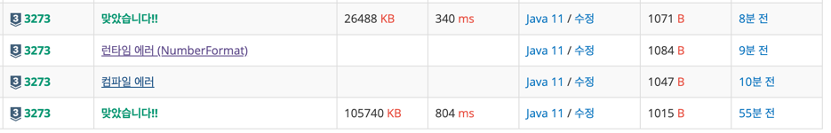

https://www.acmicpc.net/problem/3273

### 문제풀이날짜
2025-06-16

### 문제 분석 요약
- 서로 다른 양의 정수로 이루어진 수열에서 자연수 x가 주어졌을 때 ai + aj = x (1 ≤ i < j ≤ n)을 만족하는 (ai, aj)쌍의 수를 구하는 문제
- ai의 값은 1보다 크거나 같고, 1000000보다 작거나 같은 자연수
### 알고리즘 설계
#### 풀이순서
1. 정수 n을 입력 받는다
2. n만큼의 배열을 선언하고 숫자들을 입력받는다
3. 자연수(양의정수) x를 받는다
4. 배열의 수를 정렬한다
5. 포인터를 선언하고 x의 값과 같아지는 구간을 찾는다
    - 왼쪽 포인터가 가리키는 값 + 오른쪽 포인터가 가리키는 값 = x 인 경우


### 시간 복잡도
- O(NLogN)
    - 투포인터 알고리즘은 O(N)이지만 정렬이 O(NlogN)이다.
- 최대 연산 횟수(투포인터 알고리즘에서)
    - n = 100,000일 때:
        - while 반복: 최대 50,000번
        - 각 반복당 연산: 덧셈 1번 + 비교 1~2번 + 증감 1~2번
        - 평균 연산: 약 5번/반복
        - 총 연산: 50,000 × 5 = 250,000

### 코드
```java  
import java.util.*;
import java.io.*;

public class Main {
    public static void main(String[] args) throws IOException {
        BufferedReader br = new BufferedReader(new InputStreamReader(System.in));

        int n = Integer.parseInt(br.readLine());
        int[] array = new int[n];

        StringTokenizer st = new StringTokenizer(br.readLine());
        for (int i = 0; i < n; i++) {
            array[i] = Integer.parseInt(st.nextToken());
        }

        int x = Integer.parseInt(br.readLine());

        Arrays.sort(array); // 배열 정렬

        int left = 0;
        int right = n - 1;
        int count = 0;

        while (left < right) {
            int sum = array[left] + array[right];
            if (sum == x) {
                count++;
                left++;
                right--;
            } else if (sum < x) {
                left++; // 합이 작은경우 더 큰 수 필요
            } else {
                right--; // 합이 더 큰 경우 더 작은수 필요
            }
        }
        System.out.println(count);
    }
}
```

- 이 문제는 n의 입력이 적어 scanner로도 풀 수 있을거 같아서 scanner로 푼거랑 bufferedReader 둘다 사용해봤다.

### 느낀점 or 기억할 정보
- 투포인터 알고리즘
    - 두개의 포인터(인덱스)를 사용해서 배열, 리스트를 효율적으로 탐색하는 기법
    - 조건을 만족하는 쌍, 구간을 찾을때 주로 사용
    - 양쪽을 움직여서 불필요한 탐색을 줄이는것
- 이진탐색은 특정 값을 구하는 문제에서 자주 사용
