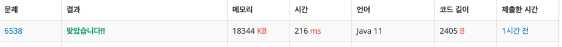

https://www.acmicpc.net/problem/6538

### 문제 풀이 날짜
2025-10-23

### 문제 분석 요약
- 2-9개의 동일한 문자는 `[길이+문자]` 로 인코딩
- 9개 초과 동일한 문자는 9개 단위로 인코딩
- 중복 없는 문자는 앞뒤에 `1`을 붙여서 표현
- 중간에 1이 있으면 11로 바꿔야 함

### 제약조건
- 입력은 문자, 숫자, 공백, 특수문자로 구성된 문자열
### 알고리즘 설계

#### 변수
- `input`: 입력 문자열
- `result`: 인코딩된 결과 문자열
- `i`: 현재 처리 중인 문자 위치 인덱스
- `currentChar`: 현재 검사하는 문자
- `count`: 연속된 동일 문자의 개수
- `nonRepeating`: 연속되지 않는 문자들을 임시 저장하는 버퍼
#### 입력
- 각 줄마다 문자, 숫자, 공백, 특수문자로 구성된 문자열
- 줄의 끝은 개행문자('\n')로 구분
- 개행문자는 인코딩하지 않고 그대로 출력
#### 연산
- 반복되는 연속문자인 경우와 반복되지 않는 문자의 두가지 경우로 나눠서 연산
- 연속문자 처리
    -  문자열의 각 문자를 순회하면서
        - 길이가 문자의 길이보다 작고 입력값이 이전 값과 같은 경우 count를 가산한다
    - 9개 초과 연속문자는 (`Math.min`을 사용해 초과하는 경우 )
    - 남은 문자가 하나라면 '1'인코딩을 붙여준다
        - 현재의 문자가 1인 경우 11을 붙이고 아닌 경우 양쪽에 각각 1을 붙여준다
- 비연속 문자 처리
    - 비연속 문자를 수집하기 위해 현재의 문자부터 순회한다
    - 길이가 문자의 길이보다 작고 입력값이 이전 값과 같은 경우에 break문으로 탐색을 멈춘다
    - 남은 문자가 하나라면 '1'인코딩을 붙여준다
        - 현재의 문자가 1인 경우 11을 붙이고 아닌 경우 양쪽에 각각 1을 붙여준다
#### 출력
- StringBuilder로 넣어준 문자열을 toString으로 변환해서 반환한다
### 시간 복잡도
- O(N) -> 라인의 길이만큼

### 코드
```java  
import java.util.Scanner;

public class Main {
    public static void main(String[] args) {
        Scanner scanner = new Scanner(System.in);
        
        while (scanner.hasNextLine()) {
            String line = scanner.nextLine();
            System.out.println(encode(line));
        }
        
        scanner.close();
    }
    
    public static String encode(String input) {
        if (input.isEmpty()) {
            return "";
        }
        
        StringBuilder result = new StringBuilder();
        int i = 0;
        
        while (i < input.length()) {
            char currentChar = input.charAt(i);
            int count = 1;
            
            while (i + count < input.length() && input.charAt(i + count) == currentChar) {
                count++;
            }
            
            if (count >= 2) {
                int remaining = count;
                
                while (remaining >= 2) {
                    int encodeCount = Math.min(remaining, 9);
                    result.append(encodeCount).append(currentChar);
                    remaining -= encodeCount;
                }
                
                if (remaining == 1) {
                    result.append("1");
                    if (currentChar == '1') {
                        result.append("11");
                    } else {
                        result.append(currentChar);
                    }
                    result.append("1");
                }
                
                i += count; 
            } else {
                StringBuilder nonRepeating = new StringBuilder();
                
                while (i < input.length()) {
                    currentChar = input.charAt(i);
                    
                    if (i + 1 < input.length() && input.charAt(i + 1) == currentChar) {
                        break;
                    }
                    
                    if (currentChar == '1') {
                        nonRepeating.append("11");
                    } else {
                        nonRepeating.append(currentChar);
                    }
                    
                    i++;
                }
                
                if (nonRepeating.length() > 0) {
                    result.append("1").append(nonRepeating).append("1");
                }
            }
        }
        
        return result.toString();
    }
}
```


### 알게된점
이 문제가 복잡하게 느껴지는 이유는 입력받는 부분에서 몇줄인지 정해져있지 않고 문자를 받는 부분에 대한 추가적인 처리가 필요하기 때문이다. 입력과 출력 부분을 제외하고 문제의 핵심은 문자열이 입력된 경우
- 문자열에서 문자가 몇개 연속되는지
- 2개 이상이라면 갯수를 넣어준다
- 1개라면 연속되지 않으니까 앞위에 1을 붙여준다
- 중간에 1이 있는 경우에는 11로 변경해준다