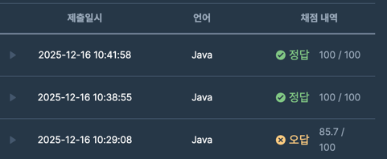

https://school.programmers.co.kr/learn/courses/30/lessons/12954

### 문제 풀이 날짜
2025-12-16

### 문제 분석 요약
- 정수 x와 자연수 n을 받아 x부터 시작해 x씩 증가하는 숫자를 n개 지니는 리스트를 구하는 문제
### 문제의 핵심
- 문제의 규칙이 `x * 1 -> x * 2 -> x * 3`  으로 하나씩 커진다
### 제약조건
- x는 -10000000 이상, 10000000 이하인 정수입니다.
- n은 1000 이하인 자연수입니다.
### 알고리즘 설계

#### 입력
- `x`: 정수
- `n`: 자연수
#### 연산
- x 자체의 크기는 21억 미만이어서 int 범위 안에 있지만 n의 최댓값인 1000을 곱했을때는 int 의 범위를 초과한다. 그래서 계산을 long 타입으로 할 수 있도록 해야한다.
- answer 배열은 long 타입이고 최대 크기는 n `new long[n]`
- n의 크기만큼 반복문 순회
    - 인덱스가 0부터 시작해서 x부터 x씩 증가하려면 (i + 1)을 곱해줘야 한다
    - `x * (i + 1)`
#### 출력
- answer 배열 출력
### 시간 복잡도
- O(N)
    - N의 크기만큼 반복

### 코드
```java  
class Solution {
    public long[] solution(int x, int n) {
        long[] answer = new long[n];
        
        for (int i = 0; i < n; i++) {
            answer[i] = (long)x * (i + 1);
        }
        
        return answer;
    }
}
```



- 다른 풀이
    - answer[0] = x라고 선언한 부분까지는 생각을 했는데 내부에 값을 어떻게 더해줄지 생각이 안나서 이 방법을 생각을 못했는데 `answer[i -1]` 의 값에 직접 접근을 해서 `+ x`를 해주는 방법이 새로웠다.

```java
class Solution {
    public long[] solution(int x, int n) {
        long[] answer = new long[n];
        answer[0] = x;
        
        for (int i = 1; i < n; i++) {
            answer[i] = answer[i - 1] + x;
        }
        
        return answer;
    }
}

```

### 알게된점
- 이 문제가 바로 풀리지 않았던 이유는 처음에 x는 그대로 넣어주고 인덱스를 곱하는 형식으로 구해줘야 하기 때문이다
- x의 크기가 int 범위 안에 있어서 내부 계산에서는 신경 쓸 필요가 없다고 생각했는데 최대 n의 크기만큼의 배열의 범위가 커질 수 있다 -> answer 배열의 크기 뿐만 아니라 계산할때도 long 타입 