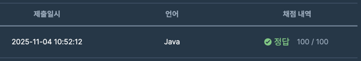

https://school.programmers.co.kr/learn/courses/30/lessons/340199

### 문제 풀이 날짜
2025-11-04

### 문제 분석 요약
- 지폐의 크기와 지갑의 크기가 주어졌을때 지갑에 넣기 위해서 지폐를 최소로 접어야 하는 횟수를 구하는 문제

### 제약조건
- 지폐를 접을 때는 항상 길이가 긴 쪽을 반으로 접습니다.
- 접기 전 길이가 홀수였다면 접은 후 소수점 이하는 버립니다.
- 접힌 지폐를 그대로 또는 90도 돌려서 지갑에 넣을 수 있다면 그만 접습니다.
- `wallet`의 길이 = `bill`의 길이 = 2
- 10 ≤ `wallet[0]`, `wallet[1]` ≤ 100
- 10 ≤ `bill[0]`, `bill[1]` ≤ 2,000
### 알고리즘 설계

문제의 핵심
- 연산 방식이 이미 주어져 있는데 bill의 작은 값이 wallet의 작은 값보다 작은 경우에 동작하게 하려면 추가적으로 정렬이 필요하다
    - 접힌 지폐를 90도, 그대로 돌려서 사용 가능하다는 조건이 있어서 가능
#### 변수
- 지폐 저장할 변수 answer

#### 입력
- 지갑의 가로세로 담긴 wallet
- 지폐의 가로세로 담긴 bill
#### 연산
- while문으로 반복한다
- bill, wallet을 정렬한다
- bill 의 인덱스가 wallet의 인덱스보다 작으면 -> 지폐가 지갑에 들어가면
    - 탐색을 멈춘다
- 그렇지 않은 경우 지폐의 더 큰쪽을 /2 한다
- 탐색횟수(answer)을 증가시킨다 ++

#### 출력
- 지폐를 접은 횟수(answer)을 출력한다
### 시간 복잡도
- O(log N)
    - while의 반복횟수가 O(log N)
    - bill의 크기에 비례해 bill을 반으로 접기 때문

### 코드
```java  
import java.util.Arrays;

class Solution {
    public int solution(int[] wallet, int[] bill) {
        int answer = 0;
        
        while(true) {
            Arrays.sort(bill);
            Arrays.sort(wallet);
            
            if (bill[0] <= wallet[0] && bill[1] <= wallet[1]) {
                break;
            }
            
            bill[1] = bill[1] / 2;
            answer++;
        }
        
        return answer;
    }
}
```


### 알게된점
- while(true) + break를 사용하면 while안에 조건문을 사용하지 않고 조건을 만족하는 경우에 break로 만족하는 경우를 찾을 수 있다
- while(조건문) 방식

```java
Arrays.sort(bill);
Arrays.sort(wallet);

while (bill[0] > wallet[0] || bill[1] > wallet[1]) {
    bill[1] = bill[1] / 2;
    answer++;
    Arrays.sort(bill);
}
```