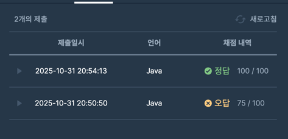

#algorithm

https://school.programmers.co.kr/learn/courses/30/lessons/152995
### 문제 분석 요약
- `[근무태도, 동료평가]` 가 저장된 이차원 배열에서 완호의 석차를 구하는 문제
- 인센티브를 못받는 경우 : score배열에서 근무태도, 동료평가가 다른 값보다 작은 경우
    - 완호가 인센티브를 받지 못하는 경우 -1 반환
- 인센티브를 받는 경우
    - 두 정수(근무태도 + 동료평가)가 높은 순으로 석차를 낸다

### 제약조건
- 두 점수의 합이 동일한 사원은 동석차, 동석차 수만큼 다음 석차는 건너뛴다
- - 1 ≤ `scores`의 길이 ≤ 100,000
- `scores`의 각 행은 한 사원의 근무 태도 점수와 동료 평가 점수를 나타내며 [a, b] 형태입니다.
    - `scores`[0]은 완호의 점수입니다.
    - 0 ≤ a, b ≤ 100,000
- 완호가 인센티브를 받지 못하는 경우 -1을 return 합니다.
### 알고리즘 설계

문제의 핵심
- 근무태도를 기준으로 내림차순 정렬을 하고 동료평가를 기준으로 오름차순으로 정렬한다
    - 근무태도 기준 내림차순 정렬을 하면 앞사람은 무조건 근무태도가 높거나 같다 -> 동료평가만 고려하면 된다
    - 같은 근무태도일 경우 동료평가를 내림차순으로 정렬하면 동료평가를 비교했을때 최대값보다 작아지기 때문에 잘못 판단해 탈락시킬 수 있다. -> 낮은 동료평가부터 최대값을 갱신

1. 정렬 (근무태도 내림차순)
2. 순회:
   a. 완호 탈락? → return -1
   b. 현재 사람 탈락? (maxPeer 사용) → continue
   c. maxPeer 갱신 (다음 사람 체크용)
   d. 석차 계산 (총점 비교, maxPeer 사용 안 함)
3. return wRank

#### 변수
- int `sum` 완호의 근무태도 + 동료평가의 합
- int `maxPeerReview` : 최대 동료평가 값
- int `wRank` : 완호의 석차
#### 입력
- `[근무 태도 점수, 동료 평가 점수]` 가 저장된 이차원 배열 scores
#### 연산
- 완호의 순위를 1위라고 선언
- 이차원 배열에서 완호의 근무태도 + 동료평가를 저장한다
- scores 배열에서 근무 태도 점수 기준 내림차순 정렬, 동료평가 기준 오름차순 정렬을 한다
- 동료평가의 최대값 0으로 선언;
- 이차원 배열을 각 배열로 순회하면서
  - 순회하는 직원의 근무태도, 동료평가보다 완호가 더 작으면 탈락 (-1 반환)
  - 순회하는 직원의 동료평가(score[1])이 갱신된 동료평가보다 작으면 인센티브 탈락 -> 석차 계산 제외
  - 현재 동료평가와 

#### 출력
- 완호의 석차를 출력
### 시간 복잡도
- O(N)

### 코드
```java  
import java.util.Arrays;

class Solution {
    public int solution(int[][] scores) {
        int answer = 0;
        
        int wAttitude = scores[0][0];
        int wPeerReview = scores[0][1];
        int wSum = wAttitude + wPeerReview;
        
        // 정렬
        Arrays.sort(scores, (a, b) -> {
            if(a[0] != b[0]){
                return b[0] - a[0];
            }  return a[1] - b[1];
       });
        
        int maxPeerReview = 0;
        int wRank = 1;
        
        for (int[] score : scores) {
            // 완호 탈락 여부
            if (wAttitude < score[0] && wPeerReview < score[1]) {
                return -1;
            }
            
            if (score[1] < maxPeerReview) {
                continue;
            }
            
            maxPeerReview = Math.max(maxPeerReview, score[1]);
            int sum = score[0] + score[1];
            if (sum > wSum) {
             wRank++;   
            }
        }
        
        return wRank;
    }
}
```


### 알게된점
- Arrays.sort 로 배열도 정렬할 수 있다는 것을 알게되었다
- 자바에서 정렬 메서드는 Comparator의 반환값을 보고 순서를 결정한다
```text
compare(a, b)의 반환값:
  음수 (< 0) → a를 b보다 앞에 배치
  0          → 순서 유지
  양수 (> 0) → b를 a보다 앞에 배치
```

- Comparator은 객체에만 사용할 수 있다
- 1차원 배열 정렬
```java
Arrays.sort(arr, (a, b) -> a - b);
```

- 2차원 배열 정렬
```java
// 일반적인 식으로 사용하는 경우
Arrays.sort(scores, (x, y) -> {
    if (x[0] != y[0]) {
        return y[0] - x[0];  // 근무태도 내림차순
    }
    return x[1] - y[1]; // 동료평가 오름차순     
});

// 삼항연산자 사용
Arrays.sort(scores, (x, y) -> x[0] == y[0] ? x[1] - y[1] : y[0] - x[0]);
```