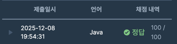

https://school.programmers.co.kr/learn/courses/30/lessons/17678

### 문제 풀이 날짜
2025-12-08

### 문제 분석 요약
- 콘이 무료 셔틀버스를 이용할 수 있는 가장 늦은 시간을 구하는 문제
    - 셔틀은 `09:00`부터 총 `n`회 `t`분 간격으로 역에 도착하며, 하나의 셔틀에는 최대 `m`명의 승객이 탈 수 있다.
    - 셔틀은 도착했을 때 도착한 순간에 대기열에 선 크루까지 포함해서 대기 순서대로 태우고 바로 출발한다. 예를 들어 `09:00`에 도착한 셔틀은 자리가 있다면 `09:00`에 줄을 선 크루도 탈 수 있다.
### 문제의 핵심
- 크루가 도착하는 시간인 timetable을 숫자로 변환해서 순서를 확인
### 제약조건
- 0 ＜ `n` ≦ 10
- 0 ＜ `t` ≦ 60
- 0 ＜ `m` ≦ 45
- `timetable`은 최소 길이 1이고 최대 길이 2000인 배열로, 하루 동안 크루가 대기열에 도착하는 시각이 `HH:MM` 형식으로 이루어져 있다.
- 크루의 도착 시각 `HH:MM`은 `00:01`에서 `23:59` 사이이다.
### 알고리즘 설계

#### 입력
- `n`: 셔틀 운행 횟수
- `t`: 셔틀 운행 간격
- `m`: 한 셔틀에 탈 수 있는 최대 크루 수
- `timetable` : 크루가 대기열에 도착하는 시각을 모은 배열
#### 연산
- 크루가 대기열에 도착하는 시간을 정렬한다
    - 시간을 담을 배열 crewTimeArr를 초기화한다. 크기는 timetable.length
    - timetable 배열을 순회한다
        - `:` 를 기준으로 시간 hour, minute를 분리한다
        - 분리한 시간을 분으로 만들어서 정렬한다
    - crewTimeArr를 오름차순 정렬한다
- 각 셔틀마다 크루를 태운다
    - 크루목록을 순회하면서 크루를 순차적으로 배정한다
- 콘의 도착시간을 계산한다
    - 마지막 셔틀시간을 계산한다
    - 아무도 타지 않았거나 자리가 남으면
        - 마지막 셔틀시간이 conTime
    - 만석이라면
        - 마지막으로 탄 크루보다 1분 일찍
            - conTime = lastBoardedCrew - 1
- 분을 "HH:MM 형식으로 변환한다"
    - 시간 : 시간 / 60
    - 분 : 시간 % 60
    - `String.format("%02d:%02d", hour, minute)`을 사용하여 문자열로 변환한다
        - %02d는 2자리 숫자로 만들고, 빈자리는 0으로 채운다
#### 출력
- 콘이 무사히 셔틀을 타고 사무실로 갈 수 있는 제일 늦은 도착 시각을 출력
- 형식은 HH:MM
### 시간 복잡도
- O(L log L)
    - L은 크루 수, 최대 2000

### 코드
```java  
import java.util.Arrays;

class Solution {
    public String solution(int n, int t, int m, String[] timetable) {
        String answer = "";
        int[] crewTimeArr = new int[timetable.length];
        
        // 문자열 시간 정수로 변환
        for (int i = 0; i < timetable.length; i++) {
            String[] time = timetable[i].split(":");
            
            int hour = Integer.parseInt(time[0]); // String -> int
            int minute = Integer.parseInt(time[1]);
            
            crewTimeArr[i] = hour * 60 + minute;
        }
        Arrays.sort(crewTimeArr);
        
        // 셔틀마다 확인
        int crewIndex = 0;
        int lastBoardedCrew = -1;
        int count = 0;
        
        for (int i = 0; i < n; i++) {
            int shuttleTime = 9 * 60 + (i * t);
            count = 0;
            
            while (crewIndex < crewTimeArr.length && count < m && crewTimeArr[crewIndex] <= shuttleTime) {
                if (i == n - 1) {
                    lastBoardedCrew = crewTimeArr[crewIndex];
                }
                crewIndex++;
                count++;
            }
        }
        
        int conTime;
        int lastShuttleTime = 9 * 60 + ((n - 1) * t);
        
        if (lastBoardedCrew == -1 || count < m) {
            conTime = lastShuttleTime;
        } else {
            conTime = lastBoardedCrew - 1;
        }
        
        int hour = conTime / 60;
        int minute = conTime % 60;
        answer = String.format("%02d:%02d", hour, minute);
        
        return answer;
    }
}
```



### 알게된점
- 어려운 개념이 사용되어서 어려웠다기 보단 계산하는 과정에서 고려해야 할게 많아서 더 어렵게 느껴졌다.
- 과정을 어떻게 일반화 해서 코드로 표현할 수 있을지에 대한 고민이 필요하다